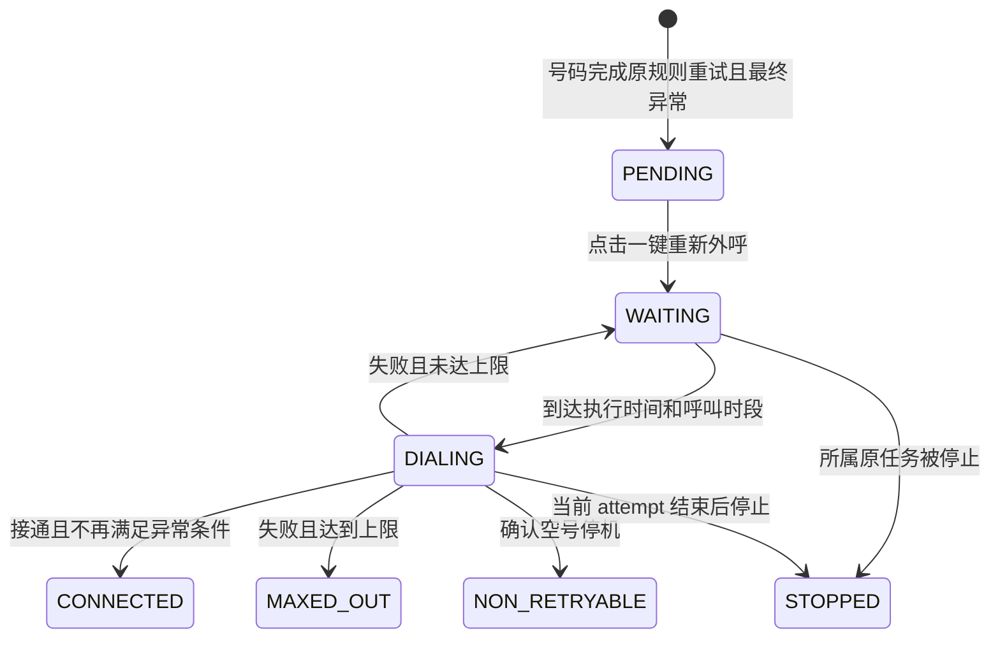

# AI Call 异常呼叫处理与一键重新外呼技术设计

## 1. 状态与目标

- 日期：2026-08-13
- 页面：`/ai-call/tasks`
- 状态：已实现，并完成登录态页面目测与隔离 PostgreSQL migration 验证
- 目标：在任务列表下方展示已经完成自身原呼叫流程的最终异常号码，由用户人工启动一批补呼。
- 安全边界：设计、开发和自动化测试均不得发起真实外呼；真实号码验收必须另行明确授权。

补呼继续属于原任务：保留原 `taskId`、`targetId`，复用原任务冻结的提示词、音色、线路和呼叫时段，只追加 attempt 和通话记录。

## 2. 已确认的产品口径

- 四张卡：无人接听（含忙线）、电话拒接、主动挂断（≤5 秒）、空号停机。
- 删除“自动再次外呼”开关和自动启动逻辑。
- 不选择任务、人物或客户；用户直接点击卡片的“一键重新外呼”。
- 点击时，该卡片当时全部“待重呼”号码组成一批；本批运行期间新进入的号码留到下一批。
- 同租户、同异常类别的本批未结束前按钮禁用；其他类别可独立启动。
- 卡片批次只按本批号码是否全部终态判断完成，不等待所属原任务或其他类别批次完成。
- 用户无需区分原任务，系统按 `taskId` 归回各自原任务，明细只展示“所属任务”。
- 原任务是否整体完成不作为号码入池或卡片解锁条件；但用户明确执行原任务的暂停、恢复或停止时，仍控制该 `taskId` 下的异常补呼号码。
- 外呼间隔从上一条呼叫记录的 `endedAt` 起算，并继续受原任务呼叫时段限制。
- 最多次数只统计异常阶段补呼，不包含原任务首次呼叫及原规则重试。
- 修改规则不影响运行批次，不自动恢复历史“已达上限”号码。
- 空号停机永久禁用补呼，只允许查看和下载。

原型初始值：

| 类别 | 间隔 | 最多补呼 | 操作 |
| --- | ---: | ---: | --- |
| 无人接听（含忙线） | 30 天 | 3 次 | 一键重新外呼、下载 |
| 电话拒接 | 120 天 | 2 次 | 一键重新外呼、下载 |
| 主动挂断（≤5 秒） | 15 天 | 2 次 | 一键重新外呼、下载 |
| 空号停机 | - | 0 次 | 仅下载 |

间隔校验为 1～365 的整数天；次数复用现有呼叫规则上限，为 1～5 的整数。

## 3. 不做事项

- 不新建“异常补呼任务”菜单、页面或业务任务类型。
- 不新建一套 attempt 或通话记录。
- 不因保存规则、提高上限或刷新页面触发外呼。
- 不修改历史 attempt、历史通话记录的真实结果。
- 异常面板本期不新增整批中断、取消或重开操作；现有原任务暂停、恢复、停止仍按 `taskId` 生效。

## 4. 进入异常池与类别判定

号码进入异常池必须同时满足：

1. 该目标为 `COMPLETED`，且 `nextAttemptAt` 为空；
2. 该目标不存在 `DIALING`、`IN_CALL` 或其他活动 attempt；
3. 该目标已经完成原呼叫规则为它安排的全部重试；
4. 该目标尚未写入异常类别。

因此，同一任务中的某个号码先完成自身全部原规则重试后即可进入下方统计，不等待该任务的其他号码；其他号码继续正常执行。

| 页面类别 | 判定 | 原始记录 |
| --- | --- | --- |
| `NO_ANSWER` | `no_answer` 或 `busy` | 保留真实 `no_answer` / `busy` |
| `REJECTED` | `rejected` | 保留 `rejected` |
| `EARLY_HANGUP` | 已接通、有接通时间、时长 ≤5 秒，客户参与者触发 `participant_left`，`disconnectReason=CLIENT_INITIATED`，且此前没有系统或坐席结束命令 | `callResult=connected`，挂断证据保留在 `endReason` 和终止证据中 |
| `INVALID_NUMBER` | `invalid_number`，包含已标准化为空号/停机的原因 | 保留供应商原始原因和标准化结果 |

仅凭短通话或笼统的 `remote_hangup` 不能判定主动挂断；缺少上述任一证据时不进入 `EARLY_HANGUP`。补呼中出现 `invalid_number` 时立即停止，不能为了凑满次数继续拨打。

## 5. 状态流转

### 5.1 异常处理展示状态

现有号码状态继续使用 `PENDING`、`DIALING`、`IN_CALL`、`RETRY_WAIT`、`COMPLETED`、`CANCELLED`。本功能不再新增一套 `exception_status` 数据库枚举；后端按照现有状态和异常字段的固定规则计算页面展示状态，不涉及 AI 推断：

| 页面文案 | 固定计算条件 | 现有号码状态 |
| --- | --- | --- |
| 待重呼 | 已归类、尚未加入批次 | `COMPLETED` |
| 等待执行 | 已加入批次并等待执行时间 | `RETRY_WAIT` |
| 重呼中 | 本批号码正在拨号或通话 | `DIALING` / `IN_CALL` |
| 已接通 | 最新补呼成功且不再满足异常条件 | `COMPLETED` |
| 已达上限 | 补呼失败且补呼次数达到批次上限 | `COMPLETED` |
| 不可重呼 | 空号停机，或补呼中确认号码无效 | `COMPLETED` |
| 已停止 | 所属原任务被用户明确停止 | `CANCELLED` |

“不可重呼”避免把从未允许补呼的号码错误展示为“已达上限”。以下状态图表达业务展示状态，不代表新增数据库枚举。



### 5.2 批次与原任务

- 批次只有 `RUNNING`、`COMPLETED`；数据库是唯一状态源。
- 启动批次不修改原任务状态、`endedAt` 或 `nextDispatchAt`；异常目标由批次和 `nextAttemptAt` 独立调度。
- 本批号码全部终态时，本批立即完成并解锁对应卡片，不等待同一原任务中的其他类别批次。
- 不修改原任务 `configSnapshot`。异常间隔和次数读取批次快照，其他配置读取原任务快照。
- 原任务暂停时，该任务下尚未开始的异常补呼继续等待，本批保持 `RUNNING`；恢复任务后继续执行。
- 原任务停止时，该任务下等待中的异常补呼沿用现有逻辑变为 `CANCELLED`，活动 attempt 结束后不再补呼，页面展示“已停止”。批次中属于其他任务的号码继续执行。
- 原任务取消只允许 `SCHEDULED`，正常情况下尚未产生可进入异常池的号码。

## 6. 最小数据变更

### 6.1 `ai_call_outbound_exception_policy`

租户级规则，只保存三个可补呼类别：

```text
id, tenant_id, category, interval_days, max_retry_count,
created_by, updated_by, created_at, updated_at
```

唯一约束 `(tenant_id, category)`。没有记录时返回原型默认值，首次修改时写入；空号停机不保存规则。

### 6.2 `ai_call_outbound_exception_batch`

人工点击产生的内部批次，不是新的外呼任务：

```text
id, tenant_id, category, status,
interval_days, max_retry_count, cutoff_at, target_count,
idempotency_key, request_fingerprint, active_slot,
created_by, started_at, ended_at
```

- 唯一 `(tenant_id, idempotency_key)`；
- 唯一 `(tenant_id, active_slot)`；运行时 `active_slot=category`，完成后置空；
- `cutoff_at` 固定本批边界，之后入池的号码不加入。

### 6.3 扩展 `ai_call_outbound_target`

新增：

```text
exception_category, exception_source_result,
exception_original_attempt_count, exception_batch_id, exception_entered_at
```

继续复用：

- `attempt_count` 和 `latest_result`；
- `next_attempt_at`；
- `ai_call_outbound_attempt` 与其 `(tenant_id, target_id, attempt_no)` 唯一约束；
- 现有通话记录。

计算口径：

```text
原任务外呼次数 = exception_original_attempt_count
异常补呼次数 = attempt_count - exception_original_attempt_count
重呼进度 = 异常补呼次数 / 批次 max_retry_count
```

不增加 attempt 阶段字段；`attemptNo > exception_original_attempt_count` 即为补呼。

## 7. 接口

统一前缀：`/ai-call-agent-api/ai-call`。

### 7.1 摘要

`GET /outbound-exceptions/summary`

```text
category, totalCount, pendingCount, maxedOutCount,
policy { intervalDays, maxRetryCount } | null,
activeBatch { batchId, targetCount, completedCount, startedAt } | null,
canStart, disabledReason
```

- 可补呼卡：`共 X 个异常号码｜待重呼 N｜已达上限 M`；
- 运行中增加：`重呼进行中 A/B`；
- 空号停机：`共 X 个异常号码｜不可重呼 X`。

### 7.2 明细

`GET /outbound-exceptions?category=&status=&keyword=&pageNum=&pageSize=`

每次必须指定类别；`keyword` 匹配客户名称或号码。返回：客户名称、脱敏号码、所属任务、最终异常结果、原任务外呼次数、重呼进度、处理状态、下次执行时间、最后外呼时间、最后结果、最后通话 `callId`。

### 7.3 规则

`PUT /outbound-exceptions/{category}/policy`

```json
{ "intervalDays": 30, "maxRetryCount": 3 }
```

PUT 不触发外呼，只影响以后启动的新批次；空号停机类别拒绝修改。

### 7.4 一键重新外呼

`POST /outbound-exceptions/{category}/retry-batches`

必须携带 `Idempotency-Key`，请求体为空。响应：

```json
{ "accepted": true, "batchId": "...", "targetCount": 24 }
```

同一事务内完成：锁类别 → 校验无运行批次 → 快照规则 → 锁定 `cutoff_at` 前全部计算为“待重呼”的号码 → 创建批次 → 现有目标状态改为 `RETRY_WAIT`（页面显示“等待执行”）→ 计算 `nextAttemptAt` → 唤醒异常目标调度。

- 相同幂等键返回同一批次；
- 已有运行批次返回 `409 EXCEPTION_BATCH_RUNNING`；
- 没有待重呼号码返回 `409 NO_PENDING_EXCEPTION_TARGET`。

### 7.5 下载与通话详情

- `GET /outbound-exceptions/export?category=`：由每张卡片底部的“下载数据”按钮调用，导出当前租户、当前卡片类别的全部异常明细；不是下载原任务列表、录音、全部通话记录或某个补呼批次。复用现有下载和脱敏规则。
- 现有通话详情增加可选 `exceptionHandling`：`category`、`status`、原任务次数、补呼次数/上限、最后结果。
- 前端只在现有通话详情抽屉“任务信息”中增加异常状态、重呼进度、最后结果；`callResult` 仍显示真实结果。

## 8. 后端实现边界

- 在现有目标投影确认该号码完成原规则全部重试并进入 `COMPLETED` 时完成一次异常归类，和目标终态同事务提交。
- 复用现有 task executor、拨号器、attempt、通话记录和任务计数投影。
- executor 增加异常目标领取条件，按 `exception_batch_id`、现有目标 `status` 和 `next_attempt_at` 调度；号码入池和批次完成不要求原任务整体完成，但调度必须尊重原任务的 `PAUSING`、`PAUSED`、`STOPPING`、`STOPPED`、`CANCELLED` 控制状态。“重试间隔/次数”读取批次快照，其余配置仍读原任务快照。
- 首次补呼时间为最后一条原 attempt 的 `endedAt + intervalDays`；后续为上一条补呼的 `endedAt + intervalDays`，再归一到允许呼叫时段。
- 本批目标全部成为“已接通、已达上限、不可重呼或已停止”后，批次完成并释放 `active_slot`；不以原任务是否 `COMPLETED` 作为批次完成条件。

## 9. 前端实现边界

- 在现有任务表下挂载一个异常面板，使用任务页局部滚动，不修改共享列表布局。
- 四张卡中不出现自动开关、任务选择器或人物选择器。
- 点击卡片打开明细抽屉；支持处理状态、客户/号码筛选。
- 启动前确认类别、待重呼数量、间隔和次数。
- 批次运行时按钮禁用；即使又有号码被计算为“待重呼”，也不能提前再次点击。
- 每张卡片底部展示“下载数据”；只下载该卡片类别的异常号码明细。
- 规则输入失焦且校验通过后保存；保存成功不拨号。
- 仅在存在运行批次时轮询摘要和当前明细，不新增 SSE 或依赖。

最小文件范围：

- 前端：现有任务 `index/domain/service`、一个异常面板组件和局部样式、现有通话详情及测试。
- 后端：现有 outbound model/schema/controller/service、attempt projection、task executor、通话详情、一份 PostgreSQL migration 及测试。

## 10. 历史、安全与防重

- migration 为历史上已完成自身原规则重试的最终异常号码回填异常类别等字段，不要求所属任务整体完成；后端按固定规则将可补呼号码展示为“待重呼”、将空号停机展示为“不可重呼”，不创建批次、不设置 `nextAttemptAt`、不触发外呼。
- 历史主动挂断只回填有明确客户侧挂断证据的记录。
- 所有查询、配置、启动、导出强制租户条件和后端 `ai_call:agent:manage` 权限。
- 号码按现有规则脱敏；导出不得绕过权限。
- 批次唯一 `active_slot`、事务条件更新、`Idempotency-Key` 和 attempt 唯一约束共同防双击、多 worker 重复拨号。
- 批次创建、号码入批、目标状态和 `nextAttemptAt` 更新在一个事务中提交，不能只依赖前端按钮禁用。

## 11. 验证与实施顺序

### 自动化验收

- 验证四类映射、忙线合并但原始结果不变、主动挂断证据门槛。
- 验证号码未完成自身原规则重试时不入池；完成后不等待同任务其他号码即可入池。
- 验证本批边界、新入池号码留到下一批、同类别并发只生成一个批次。
- 验证不同类别批次独立完成；一个批次不等待同一原任务下的其他类别号码。
- 验证间隔从上一记录结束时间起算并遵守呼叫时段。
- 验证沿用原 `taskId/targetId/configSnapshot`、attemptNo 递增、旧记录不变。
- 验证次数上限、空号立即停止、规则快照不被后续修改影响。
- 验证原任务暂停时本任务号码等待、恢复后继续，停止后本任务号码终止且不影响批次中的其他任务。
- 验证租户、权限、幂等；原任务是否整体完成不影响异常批次完成判断，但明确的暂停、恢复、停止必须按 `taskId` 生效。
- 前端验证四卡、无自动开关/选择器、按钮锁定、明细筛选、脱敏和通话详情扩展。

### 实施顺序

1. migration、模型、分类函数及测试；
2. 批次事务、幂等、executor 分支，使用 fake dialer 验证状态闭环；
3. 摘要、明细、规则、下载和通话详情接口；
4. 前端卡片、明细抽屉、批次锁和记录详情；
5. 前后端相关回归、隔离 PostgreSQL migration 和本地页面验收。

工程验证使用 mock/fake dialer，不使用真实号码或真实 SIP Provider。进入编码前不需要再新增产品文档，本文件即实现和验收基线。
