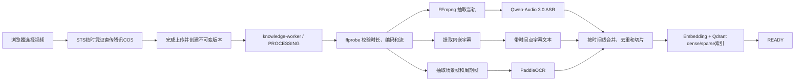

# 知识库 Embedding 与视频入库方案（2026-08-17）

## 结论

- 一期将 PDF、Office 文档、图片 OCR、音视频 ASR 和视频帧 OCR 的结果统一转成“带来源位置的文本切片”，再使用同一套文本 Embedding 和检索链路。
- 生产向量数据库确定使用私有网络自建 Qdrant。先比较两套完整检索方案：云端 `qwen3.7-text-embedding` dense + PostgreSQL 精确词召回，以及本地 BGE-M3 dense+sparse；dense 向量及 BGE-M3 sparse 均进入 Qdrant。哪套在真实业务问题上的召回、延迟和总成本更合适，就采用哪套。[Qdrant 混合检索](https://qdrant.tech/documentation/search/hybrid-queries/) [BGE-M3 模型卡](https://huggingface.co/BAAI/bge-m3)
- 如果知识正文和客户问题禁止发送给阿里云，本地候选同时评测 `Qwen3-Embedding-0.6B` dense（Qdrant）+ PostgreSQL 精确词检索与 BGE-M3 dense+sparse（Qdrant）。这里的“Qwen3”不等于调用阿里云：模型权重下载到我方服务器后，运行期的文本、问题和向量都留在私有网络。
- PostgreSQL 继续保存知识条目、版本、切片正文、来源和任务状态；Qdrant 只保存检索 Point、dense/sparse 向量及过滤 Payload。若 BGE-M3 sparse 在真实问题上更优，就由 Qdrant 在同一个 Point 内完成 dense+sparse 混合检索；multi-vector 只有在 dense+sparse 仍达不到验收标准时再评估。
- 视频一期理解三类信息：音轨中的讲话、内嵌/烧录字幕、画面中的标题/幻灯片文字；不承诺理解没有语言和文字的动作、物体关系或操作过程。
- 知识库原文件固定保存在私有腾讯云 COS；本地 Worker 从 COS 读取视频并使用 FFmpeg 抽取音轨，只把派生音频通过短时签名 URL 提交给 Qwen-Audio 3.0。关键帧留在本地用 PaddleOCR，不把整段视频交给 ASR。
- 浏览器统一使用腾讯云 `cos-js-sdk-v5` 高级上传：后端签发仅允许指定对象 Key 和上传动作的短时 STS 凭证，SDK 根据 100 MB 业务阈值选择简单上传或 Multipart 分块上传。永久 SecretId/SecretKey 不进入浏览器，文件字节也不经过 API 进程内存。

## 1. Embedding 准备怎么做

### 1.0 Embedding 是什么，模型怎么选

Embedding 模型不是负责回答问题的大模型，也不是向量数据库。它只做一件事：把一段文字转换成一串数字，使“交付一般多久”和“实施周期是多少”可以按语义接近程度被检索出来。文档切片生成的向量保存在 Qdrant；客户提问时再生成查询向量，Qdrant 计算相似度并找出相关切片，最后仍由现有 Qwen 根据证据回答。

### 向量维度是什么

“1024 维”不是 1024 个字、1024 个 Token 或 1024 个分类，而是每段文字被模型转换成 **1024 个浮点数**：

```text
“标准交付周期是 7 个工作日”
        -> Embedding 模型
[0.018, -0.072, 0.113, ...]  共 1024 个数字
```

单个数字没有可读业务含义，整组数字共同表示文本在模型语义空间中的位置。客户问题也转换成同样长度的一组数字，Qdrant 比较两组向量的夹角或距离。必须遵守：

- 同一个检索库中的文档和问题使用**同一模型、同一维度和同一归一化规则**；
- 同一个 Qdrant named vector 不能混放 1024、768 或 1536 维向量；
- 更换模型或维度需要重算全库向量，不能把新旧向量混在同一个索引里；
- 维度越高通常能保留更多信息，但存储、内存和距离计算也随之增加，不代表维度翻倍、质量就翻倍。

`qwen3.7-text-embedding` 可选 2560、2048、1536、1024（默认）、768、512、256 维。阿里云把 1024 维列为通用检索的效果/成本平衡点；1536/2048 用于经过评测证明需要更高精度的场景，768 及以下用于资源高度敏感场景。[阿里云向量维度说明](https://help.aliyun.com/zh/model-studio/embedding?disableWebsiteRedirect=true)

1024 维继续作为共同评测基线，是因为 `qwen3.7-text-embedding` 默认支持该维度、BGE-M3 固定输出 1024 维，而且存储和搜索成本可控；不是 Qdrant 的硬限制。Qdrant Collection 会明确配置每个 named vector 的维度和距离算法，更换模型或维度时新建 Collection、完整重建索引后再切换 Alias，不能直接修改现有向量空间。[Qdrant Collection](https://qdrant.tech/documentation/manage-data/collections/)

### 候选模型详细对比

不存在“业内所有 RAG 都统一使用的一款模型”。成熟做法是：先按数据是否允许出域确定云端或本地，再拿真实问题集比较 Recall@K、Top 1 命中、延迟和总成本。下表是截至 2026-08-17 与本项目最相关的候选，不是市场份额或绝对排名：

| 方案 | 部署与数据流 | 官方能力 | 相对成本/运维 | 对本项目的判断 |
| --- | --- | --- | --- | --- |
| 阿里云 `qwen3.7-text-embedding` | 云 API；发送解析后的文本切片和客户问题，不发送原 PDF/视频 | 201 种语言/方言；256～2560 维；默认 1024；支持 `query/document` 和任务指令 | 按 Token 付费；无需 GPU 和模型服务；实时调用简单 | 云端低运维基线；需与 BGE-M3 完整混合检索做业务 A/B 后再决定 |
| 阿里云 `text-embedding-v4` + Batch | 文档切片组成 JSONL 文件上传到百炼 Batch；查询仍实时调用同一个 v4 | 100+ 语言；64～2048 维；默认 1024；Batch 最长 24 小时异步完成 | 北京区实时价格与 qwen3.7 相同；Batch 为实时价格 50%；需要提交、轮询、下载和失败重跑 | 只在一次入库几十万/百万切片、Embedding 费用和吞吐已成为问题时考虑；它不是问答模型 |
| 本地 `Qwen3-Embedding-0.6B` | 权重与推理进程在我方服务器；运行期文本和问题不出域 | 0.6B 参数；32K；最高 1024 维；100+ 语言；支持自定义任务指令 | 无按 Token 费用，但需要机器、模型下载、服务部署、监控和压测 | **禁止文本出域时的首选本地候选**；规模最小，正好匹配 1024 维 dense 检索 |
| 本地 `Qwen3-Embedding-4B` | 同上 | 4B 参数；32K；最高 2560 维；支持 MRL 自定义较低维度 | 比 0.6B 更吃内存/显存，吞吐更低；需要 GPU 评测 | 只有真实问题集证明 0.6B 召回不够再测；不作为一期默认 |
| 本地 `Qwen3-Embedding-8B` | 同上 | 8B 参数；32K；最高 4096 维；支持 MRL | 本地成本和运维最高；向量维度和存储开销也最大 | 当前规模没有证据值得部署 |
| 本地 `BAAI/bge-m3` | 权重与推理进程在我方服务器；运行期数据不出域 | 约 568M 参数；1024 维；8192 Token；dense、sparse、multi-vector 三种检索 | Qdrant 可在同一 Point 保存 dense+sparse 并用 RRF 融合；multi-vector 的存储与计算成本更高 | 重点候选；若 dense+sparse 效果更好，可直接替换 qwen3.7 + PostgreSQL 精确词方案，不能因旧计划排除 |
| OpenAI `text-embedding-3-small/large` | OpenAI 云 API；文本与问题发给 OpenAI | 默认 1536/3072 维，可降维；最长 8192 Token；large 面向英文和非英文 | 成熟云 API；新增供应商、密钥、计费和数据合规；large 成本高于 small | 技术可用，但本项目没有必须新增第二家境外云供应商的收益 |
| Cohere `embed-v4.0` | Cohere 云 API，也可从部分云市场使用；文本/图片发送给供应商 | 256/512/1024/1536 维；默认 1536；128K；100+ 语言；支持文本和图片 | 多模态检索能力强，但新增供应商和合规链路 | 本项目先把 OCR/VLM 结果统一成可审核文本，不需要为混合图文 Embedding 引入它 |
| Google `gemini-embedding-2` | Gemini/Vertex 云 API；输入内容发给 Google | 128～3072 维；推荐 768/1536/3072；支持文本、图片、音频、视频和 PDF | 云端多模态便利，但新增供应商；视频单次最长 120 秒且最多处理 32 帧 | 不适合替代本项目 2 小时视频的 ASR/OCR/VLM 时间线方案，也没有必要只为文本 RAG 引入 |

官方资料：[阿里云 Embedding 规格与价格](https://help.aliyun.com/zh/model-studio/embedding?disableWebsiteRedirect=true)、[阿里云 Batch 工作流](https://help.aliyun.com/zh/model-studio/batch-interfaces-compatible-with-openai/)、[Qwen3-Embedding 开源模型表](https://github.com/QwenLM/Qwen3-Embedding)、[BGE-M3 模型卡](https://huggingface.co/BAAI/bge-m3)、[OpenAI Embedding 文档](https://developers.openai.com/api/docs/guides/embeddings)、[Cohere Embed 模型表](https://docs.cohere.com/docs/cohere-embed)、[Google Gemini Embedding 文档](https://ai.google.dev/gemini-api/docs/embeddings)

`text-embedding-v4 Batch` 的“Batch”是调用方式，不是另一种数据库或生成模型。Worker 把大量离线切片写成 JSONL、提交异步任务，供应商在最长 24 小时窗口内处理，再下载结果；适合首次导入或全库重建，不适合通话中的实时问题。更关键的是，若文档使用 v4，通话问题也必须实时调用 v4；不能文档用 v4 Batch、问题用 qwen3.7，否则向量不在同一空间。

本地模型也不是“安装一个 Python 包就结束”。至少要在私有网络部署一个 Embedding 推理进程，下载并固定模型权重，配置 CPU/GPU、模型缓存、健康检查和并发限制，再由知识 Worker 与通话检索服务调用。官方资料没有给出对所有硬件都成立的最低内存/显存，不能先编造机器规格；必须拿本项目 500～1000 字切片和实际并发压测。[Hugging Face TEI 官方部署说明](https://github.com/huggingface/text-embeddings-inference)

最终按评测结果只上线一套生产方案：

1. 允许文本出域时，比较 `qwen3.7 dense（Qdrant）+ PostgreSQL 精确词` 与 `BGE-M3 dense+sparse（Qdrant）`。
2. 禁止文本出域时，比较 `Qwen3-Embedding-0.6B dense（Qdrant）+ PostgreSQL 精确词` 与 `BGE-M3 dense+sparse（Qdrant）`。
3. 使用同一批真实业务问题比较 Recall@5、Top 1 命中、无答案误召回、端到端延迟、索引大小和运维成本；不能只比较单模型排行榜。
4. BGE-M3 的 multi-vector 暂不放入第一轮，只有 dense+sparse 仍不达标时才测，避免同时改变太多变量。

评测阶段可以并行生成候选索引，生产运行只保留胜出的一套；不为了模型可切换性建设通用平台。更换模型时重新生成全部向量即可。

### 1.1 入库

```text
解析文本 / OCR / ASR
        -> 规范化和去重
        -> 按语义与来源位置切片
        -> 评测胜出的 Embedding（document，1024维）
        -> PostgreSQL knowledge_chunk 保存正文与来源
        -> Qdrant Point 保存 dense 及可选 sparse 向量
        -> 全部核对成功后 knowledge_version 进入 READY
```

每个切片至少保留：

- `tenant_id`、知识条目 ID、不可变知识版本 ID；
- 文本、内容哈希、切片顺序；
- 来源类型：正文、图片 OCR、ASR、字幕或视频帧 OCR；
- PDF 页码，或音视频开始/结束毫秒；
- Embedding provider、模型名、维度、Qdrant Collection/Point ID 和生成时间。

同一个 `knowledge_version_id + chunk_hash + embedding_model + dimension` 必须幂等，并生成确定性的 Qdrant Point UUID。Worker 重试时使用 upsert 覆盖同一个 Point，不产生重复向量。Qdrant 和 PostgreSQL 之间不做伪分布式事务：只有切片数量、Point 数量、模型和维度全部核对一致后，才在 PostgreSQL 把版本切为 `READY`；失败版本不会被任务冻结或检索。

Qdrant Collection 按“Embedding 空间”建立，不按租户、场景或文件建立：

```text
Collection Alias: knowledge_chunks_current
Collection:       knowledge_chunks_<indexGeneration>

named vectors:
  dense:  size=1024, distance=Cosine
  sparse: 仅 BGE-M3 dense+sparse 方案启用

Point payload:
  tenant_id
  knowledge_item_id
  knowledge_version_id
  chunk_id
  source_type
  index_generation
```

切片正文、页码、时间点和文件信息以 PostgreSQL 为事实源，Qdrant 不重复保存大段正文。一个 embedding generation 使用一个 Collection，所有租户通过 `tenant_id` Payload 隔离；`tenant_id` 建 keyword tenant index，`knowledge_version_id` 和 `chunk_id` 建 keyword Payload Index。Qdrant 官方建议多数多租户场景使用单 Collection + Payload 分区，避免为每个租户创建大量 Collection。[Qdrant 多租户](https://qdrant.tech/documentation/tutorials/multiple-partitions/)

### 1.2 检索

```text
客户最终问题
  -> 评测胜出的 Embedding（query，1024维）
  -> Qdrant 强制过滤 tenant_id + 当前任务冻结的知识版本
  -> dense 召回，或 dense+sparse 混合召回
  -> 返回 chunk_id Top 3~5
  -> PostgreSQL 批量读取正文、文件名、页码/时间点
```

dense 检索处理“交付一般要多久”和“实施周期”的语义相近问题；精确词召回保护产品名、型号、金额、政策编号等内容：

- 若胜出的是 BGE-M3，Qdrant 对同一 Point 的 `dense` 和 `sparse` 各取候选，再由 Query API 使用 RRF 融合；
- 若胜出的是 Qwen dense，Qdrant 负责 dense，PostgreSQL 负责精确词候选，检索服务按排名做 RRF；
- 无论哪套方案，`tenant_id`、任务冻结的 `knowledge_version_id` 都来自后端可信上下文，模型不能传入或扩大范围。

Qdrant 官方支持同一 Point 的多个 named vector、dense+sparse 预取及 RRF 融合。[Qdrant Hybrid Query](https://qdrant.tech/documentation/search/hybrid-queries/) 阿里云明确区分 `query` 与 `document` 输入角色，并说明生产环境应预计算文档向量、检索时只计算查询向量。[阿里云向量化参数说明](https://help.aliyun.com/zh/model-studio/embedding?disableWebsiteRedirect=true)

一期不启用：

- 多模态 Embedding：当前目标是可引用的事实问答，不是文搜图或相似视频搜索；
- Reranker：只有离线问题集证明 Top 结果排序不够时再加入；
- Qdrant Cloud、分布式集群、量化和手工 HNSW 调参：一期单节点使用固定版本和默认索引参数，并用 exact search 对照评测召回；出现实际容量、延迟或可用性证据后再调整；
- 每租户/每文件一个 Collection：使用单 Collection + Payload 隔离，避免大量小 Collection 的资源开销。

### 1.3 数据出域

“Embedding 本地化”只控制向量化这一步，不会自动把 ASR、VLM 也变成本地。各类数据是否出域必须分开看：

| 数据 | 云端 `qwen3.7-text-embedding` | 本地 `Qwen3-Embedding-0.6B` | 其他处理链路 |
| --- | --- | --- | --- |
| 原 PDF、Word、图片 | 留在私有腾讯云 COS，不直接发给 Embedding API | 留在私有腾讯云 COS | 本地解析器/PaddleOCR 处理，因此不出域 |
| 原视频 | 留在私有腾讯云 COS，不直接发给 Embedding API | 留在私有腾讯云 COS | 当前目标只将派生音频交给云 ASR；若启用云 VLM，再发送选定帧或短片段 |
| 解析后的正文/OCR/ASR/VLM 文本切片 | **发送阿里云 Embedding API** | **不出域，在本地生成向量** | Batch 模式会把包含这些切片的 JSONL 上传到百炼 Files API，不是上传原文件 |
| 通话中的客户知识问题 | **发送阿里云 Embedding API** | **不出域，在本地生成查询向量** | 命中的 Top K 证据后续仍会进入当前回答模型；若回答模型是云端，这部分也需纳入合规范围 |
| 视频派生音频 | 与 Embedding 选择无关 | 与 Embedding 选择无关 | 使用 Qwen-Audio 云 ASR 时会通过短时签名 URL 发送/开放给阿里云读取 |
| 视频关键帧/短片段 | 与 Embedding 选择无关 | 与 Embedding 选择无关 | 只有启用云 VLM 时出域；不启用 VLM或部署本地 VLM时不出域 |
| 生成后的向量 | 返回并存入我方私有 Qdrant | 直接存入我方私有 Qdrant | Qdrant 自建在私有网络，不需要放到阿里云或 Qdrant Cloud |

所以，使用本地 `Qwen3-Embedding-0.6B` **不需要把资料放到阿里云**，但如果仍使用阿里云 ASR，派生音频依然会出域；如果后来使用云 VLM，关键帧或短片段也会出域。只有 Embedding、ASR、VLM、回答模型全部本地化，才能称为全链路不出域。

`Qwen3-Embedding-0.6B` 的“Qwen”表示模型家族；它是可下载的开源权重，和阿里云托管 API `qwen3.7-text-embedding` 是两种不同部署方式。第一次下载模型权重会访问模型仓库，但运行期不需要上传业务数据。它不保存原文件，也不替代腾讯云 COS、PostgreSQL 或 Qdrant。

### 1.4 Qdrant 部署边界

一期采用单节点自建 Qdrant：

- 与 API、knowledge-worker 和 PostgreSQL 部署在同一私有网络，不开放公网端口，浏览器和 Realtime 模型不能直接访问；
- 固定经过验证的 Qdrant 镜像版本，不使用 `latest`；挂载持久化磁盘，Qdrant 进程重启不能丢 Point；
- 启用 API Key，写入凭证只给 knowledge-worker，查询服务使用只读或最小权限凭证；生产链路启用 TLS；
- 定时生成 Collection Snapshot 并复制到私有腾讯 COS 备份前缀，发布前至少完成一次实际恢复演练；
- Qdrant 只负责向量检索，不负责生成 Embedding，因此运行 Qdrant 本身不需要 GPU；GPU 需求只由本地 Embedding、ASR 或 VLM 决定。

单节点不是高可用。只有容量、P95 延迟或业务 SLA 证明单节点不足时，才升级三节点副本/分片集群；不一期预建分布式集群。Qdrant 官方明确说明自建实例默认没有安全防护，必须主动配置网络绑定、认证和 TLS；Snapshot 可使用本地或 S3 兼容存储。[Qdrant 安全配置](https://qdrant.tech/documentation/operations/security/) [Qdrant Snapshot](https://qdrant.tech/documentation/snapshots/)

## 2. 视频入库完整链路



### 2.1 上传与校验

知识库源文件明确使用私有腾讯云 COS。现有 AI Call 录音仍可继续使用 MinIO；这次不迁移录音、不复用录音桶，也不把两个存储系统伪装成同一个地址。

COS 上传统一使用“后端创建上传会话和 STS 临时凭证，浏览器使用官方 JavaScript SDK 直传”的方式：

```text
1. 浏览器 -> 后端：申请上传，提交文件名、大小、MIME 和内容分类
2. 后端：校验租户/权限/大小，创建 UPLOADING 知识版本和不可变 COS Key
3. 后端 -> 腾讯 STS：申请只允许该 Key 上传动作的短时临时凭证
4. 浏览器 -> 腾讯 COS：cos-js-sdk-v5 uploadFile 直接上传文件字节
5. 浏览器 -> 后端：提交上传完成信息
6. 后端 -> 腾讯 COS：HeadObject 确认对象存在、大小一致
7. 后端：版本进入 PROCESSING，创建 knowledge-worker 任务
```

腾讯云官方说明，预签名 URL 上传仅支持简单上传，不支持分块上传和断点续传；而 JavaScript SDK 的 `uploadFile` 高级接口可以根据阈值自动选择简单上传或 Multipart，并支持并发分块、暂停、恢复和取消。因此本项目不再维护“小文件预签名、大文件自研 Part 签名”两套浏览器逻辑，统一使用 STS 临时凭证 + `cos-js-sdk-v5`。[腾讯云前端直传实践](https://cloud.tencent.com/document/product/436/76598) [腾讯云 JavaScript SDK 上传对象](https://cloud.tencent.com/document/product/436/64960) [腾讯云预签名上传限制](https://cloud.tencent.com/document/product/436/14114)

分片上传只对大文件开启：

- `<= 100 MB`：SDK 使用简单上传，失败重传整个对象；
- `> 100 MB`：SDK 使用 COS Multipart，16～32 MB 一片作为初始值、最多 3 片并发；单片失败只重传该片；
- SDK 管理 `UploadId`、Part Number 和 ETag；暂停或刷新后只续传缺失分片；取消时调用 Abort Multipart Upload。

100 MB 是本项目的业务阈值，不是 COS 的硬限制；正式值应根据真实上传网络压测调整。COS Multipart 支持初始化、上传分块、列出已上传分块、完成和终止，未完成的分块会持续占用存储空间并产生费用。[腾讯云 COS 分块上传](https://cloud.tencent.com/document/product/436/112224)

后端只保留上传控制面，不转发文件字节。目标接口最少需要三组：

| 后端接口 | 后端/COS 操作 | 浏览器行为 |
| --- | --- | --- |
| `POST /knowledge/uploads` | 校验租户/权限/文件名/大小，创建上传会话、知识版本和服务端生成的 COS Key；向 STS 申请只允许该 Key 上传的临时凭证 | 初始化 `cos-js-sdk-v5`，调用 `uploadFile` |
| `GET /knowledge/uploads/{id}` | 只返回业务上传会话、版本和处理状态，不返回永久密钥 | 页面恢复后核对任务是否仍有效 |
| `POST /knowledge/uploads/{id}:complete` / `:abort` | Complete 后使用服务端 COS SDK 执行 HeadObject 校验；Abort 时终止未完成 Multipart 并更新业务状态 | SDK 成功或取消后通知后端 |

例如 500 MB 视频按 16 MB 切分约 32 片，第 17 片失败时只重试该片。COS 允许 Part 并行和乱序上传，但完成请求必须按 Part Number 排序并携带各 Part 的 ETag。完成后的对象 ETag 不作为业务 SHA-256 使用。[腾讯云 Complete Multipart Upload](https://cloud.tencent.com/document/product/436/7742)

完成校验按以下最小闭环做：

1. Bucket、Region、Key、租户和知识版本均由后端上传会话确定，禁止浏览器自行指定。
2. STS Policy 只授予 SDK 实际需要的上传和续传动作，并通过资源或前缀条件限制在本次知识对象；不授予下载或删除其他已完成对象的权限。
3. 临时凭证有效期覆盖本次上传即可，永久 SecretId/SecretKey 只保存在后端密钥配置中，不写入 `UMI_APP_*`、日志或数据库业务字段。
4. COS SDK 完成上传后，后端使用 HeadObject 校验对象存在、大小和申请值一致，再把版本从 `UPLOADING` 转成 `PROCESSING`；重复 complete 必须幂等。
5. Worker 使用受限服务端身份流式读取对象，计算 SHA-256，并校验扩展名、真实 MIME、文件头、时长和音视频流；Multipart ETag 不代替内容校验。
6. 用户取消、会话过期或知识条目删除前调用 Abort；COS 配置 `AbortIncompleteMultipartUpload` 生命周期规则兜底清理孤儿 Part。[腾讯云 COS 生命周期规则](https://cloud.tencent.com/document/product/436/17029)

对象 Key 使用服务端生成的不可变路径，不使用原文件名作为唯一键：

```text
ai-reach/knowledge/<tenantId>/<knowledgeItemId>/<versionId>/source.<ext>
```

PostgreSQL 保存 `storage_provider=tencent_cos`、Bucket、Region、Object Key、大小、MIME 和 SHA-256，不保存长期可访问 URL。预览和下载时，后端先校验租户与权限，再生成几分钟有效的 COS 预签名 GET；视频播放可以直接使用该地址发起 Range 请求。

知识文件直接访问 COS，因此不复用现有 `/ai-call-oss/` MinIO 反向代理。COS Bucket CORS 只允许正式 Reach 域名和本地开发域名、SDK 实际需要的 HTTP 方法和请求头，并暴露 `ETag`；禁止 `AllowedOrigin=*`。腾讯云 JavaScript SDK 要求配置 CORS，并明确需要暴露 ETag。[腾讯云 COS JavaScript SDK 快速入门](https://cloud.tencent.com/document/product/436/11459)

视频派生音频放到同一私有 Bucket 的临时前缀，由 Worker 为 Qwen-Audio 生成短时预签名 GET，ASR 完成后删除或按生命周期自动过期；PaddleOCR 关键帧仅在 Worker 临时目录处理并及时清理。

当前 AI Call 后端已有 MinIO 私有对象和小范围 `ffprobe` 基础，但尚无腾讯 COS 知识上传会话、STS 临时凭证、`cos-js-sdk-v5` 前端上传、知识 Worker 或 Qdrant 入库闭环。因此这是目标方案，不是当前代码已支持的能力。

### 2.2 音轨转写

FFmpeg 不是 AI 模型。它是一套开源音视频工具，负责“拆、转、抽”：`ffprobe` 先查看视频里有哪些视频流、音轨和字幕流；`ffmpeg` 再抽出音轨、转换采样率、提取字幕和抽取图片帧。语音变文字仍由 ASR 完成，图片文字识别仍由 PaddleOCR 完成。FFmpeg 官方把 `ffmpeg` 定义为媒体转换工具，把 `ffprobe` 定义为媒体流分析工具。[FFmpeg 官方介绍](https://ffmpeg.org/about.html)

Worker 先使用 `ffprobe` 获取容器、时长、音轨和字幕流，再使用 FFmpeg 取默认音轨，去掉视频流并转为单声道 16 kHz FLAC。FFmpeg 官方说明 `-map` 可显式选择流，`-vn` 可禁止输出视频流。[FFmpeg 流选择](https://ffmpeg.org/ffmpeg.html#Stream-selection)

派生音频上传到临时私有对象，提交前生成短时公网可读 URL。`qwen-audio-3.0-asr-flash-filetrans` 接受 HTTP/HTTPS 音视频 URL、单次一个文件，支持 MP4/MOV/MKV/WebM 等容器，最大 2 GB/12 小时；说话人分离建议不超过 2 小时。[阿里云 ASR 规格](https://help.aliyun.com/zh/model-studio/asr-model/)

“说话人分离”是把同一段录音中的不同人标成 `speaker_id=1/2/...`，例如访谈中区分主持人和客户；它不是把左右声道拆开，也不是识别人名。开启后，ASR 需要额外判断每句话是谁说的。官方建议音频不超过 2 小时，是因为更长文件可能超时或识别失败，不是说第 2 小时后一定被截断。该功能只适用于单声道音频，所以 Worker 先转成单声道；课程旁白、单人产品讲解无需开启，多人会议/访谈才开启。[阿里云说话人分离参数说明](https://help.aliyun.com/zh/model-studio/paraformer-recorded-speech-recognition-python-sdk)

本项目产品限制仍建议更小：500 MB、2 小时。提交参数：

- `language_hints=["zh"]`；
- 从关联场景生成少量产品名、公司名和行业术语热词；
- 最多 400 字的领域上下文；
- `diarization_enabled=false` 默认关闭，访谈/会议资料再开启。

任务返回 `task_id` 后由 Worker 低频轮询；结果完成后立即下载并持久化，因为 `transcription_url` 只有 24 小时有效。结果包含句级/词级时间戳，开启说话人分离时包含 `speaker_id`。[Qwen-Audio FileTrans HTTP API](https://help.aliyun.com/zh/model-studio/fun-asr-recorded-speech-recognition-http-api)

Qwen-Audio 在这里是语音识别器。官方返回结构描述的是音轨、采样率、语音内容、句子和词时间戳，没有画面语义结果；“支持 MP4”表示可从视频容器处理音轨，不能据此宣称理解视频画面。这是根据官方输入/输出契约作出的工程判断。

### 2.3 字幕和画面文字

SRT 和 WebVTT 是“带时间点的字幕文本文件/字幕轨”，内容类似：

```text
00:01:12.000 --> 00:01:15.000
标准交付周期为 7 个工作日
```

它们可能作为视频里的独立字幕轨，也可能作为同名的 `.srt`/`.vtt` 文件随视频一起上传。WebVTT 是 W3C 定义的网页字幕格式；FFmpeg 支持读取和写入 SRT、WebVTT。[W3C WebVTT 规范](https://www.w3.org/TR/webvtt1/) [FFmpeg 字幕格式支持](https://ffmpeg.org/general.html#Subtitle-Formats)

必须区分两类字幕：

- **文本字幕**：字和时间点本来就在文件/字幕轨里，FFmpeg 直接提取，不需要 OCR；
- **烧录字幕（硬字幕）**：字已经画进视频像素，像电视画面下方的白字，文件里没有可直接复制的文本，只能抽帧后 OCR。

处理顺序：

1. 有文本型内嵌字幕时，直接提取字幕和时间戳，准确率和成本都优于 OCR。
2. 对幻灯片、标题页和界面文字，FFmpeg 抽取场景变化帧，并增加低频周期采样，防止缓慢切页漏帧。
3. 对帧做相邻去重后调用本地 PaddleOCR，只保留超过阈值的识别文本。
4. 同一时间窗口内重复出现的烧录字幕合并，避免每几秒产生重复切片。

FFmpeg 的 `scene` 值在 0 到 1 之间，官方示例认为 0.3–0.5 是合理起点；正式阈值应通过本项目视频样本调节。[FFmpeg select/scene](https://ffmpeg.org/ffmpeg-filters.html#select_002c-aselect)

PaddleOCR 接收图片数组、图片路径和 PDF，不直接接收视频。因此必须先由 FFmpeg 生成图片帧，再交给 OCR。它能识别画面里的文字，但不能判断人物动作、产品外观含义或操作步骤。[PaddleOCR 输入说明](https://www.paddleocr.ai/main/en/version3.x/pipeline_usage/OCR.html)

“关键帧 + PaddleOCR”可以用一个例子理解：培训视频在 10:00 切到一页 PPT，画面写着“标准交付周期：7个工作日”，讲解人当时没有念这句话。FFmpeg 在换页时保存 10:00 的一张图片，PaddleOCR 从图片读出这行字，系统保存为：

```json
{
  "source_type": "video_frame_ocr",
  "start_ms": 600000,
  "text": "标准交付周期：7个工作日"
}
```

随后它像普通文档文本一样切片和 Embedding，客户问交付周期时就能检索到，并引用“视频 10:00”。“关键帧”不是视频编码里的每一个 I 帧都入库，而是 Worker 按换页/场景变化加低频周期采样选出的少量代表图片；相邻画面去重后再 OCR，避免同一条字幕每秒重复入库。

### 2.4 时间线合并与切片

ASR、字幕和 OCR 不互相覆盖，而是先保留来源，再按时间窗口合并：

- 内嵌字幕与 ASR 高度重复时保留质量更好的文本，并保留两种来源标记；
- 画面标题、金额和参数作为同时间段的补充证据；
- 以完整句子和话题边界为主，按约 500–1000 中文字符聚合；
- 每个视频切片保存 `start_ms`、`end_ms`，检索结果可以直接跳到原视频时间点。

如果至少一条路径产生有效文本，版本可以进入 `READY`，同时记录其他路径的警告；三条路径均无可检索文本才进入 `FAILED`。不额外增加 `PARTIAL` 页面状态。

## 3. 一期明确不做的“视频理解”

以下视频无法靠 ASR + OCR 完整理解：

- 无讲解、无字幕的产品操作演示；
- 只靠人物动作表达的流程；
- 需要比较外观、图表关系或空间位置的问题。

要覆盖它们，需要 VLM（Vision-Language Model，视觉语言模型）真正“看画面”。它与 PaddleOCR 的区别是：OCR只能抄出画面上的字；VLM可以描述“操作员先打开设置页，再选择线路并点击保存”“产品外壳左侧有两个接口”等动作、对象和前后状态。

三种路线的能力、数据和成本区别如下：

| 路线 | 能回答什么 | 数据是否出域 | 需要实现什么 | 相对成本/难度 |
| --- | --- | --- | --- | --- |
| 不接 VLM，只做 ASR+字幕+PaddleOCR | 讲话内容、字幕、PPT/界面可见文字；不能可靠回答无文字动作和外观 | 派生音频会发给云 ASR；图片帧留在本地 OCR | 已规划的 FFmpeg、ASR、OCR、时间线合并 | **低，基础闭环** |
| 云端抽帧/短片段 VLM | 增加人物/对象、操作步骤、外观、前后状态 | 选定关键帧或短视频片段发送阿里云；不必发送整段原视频 | 场景切段、短时签名 URL、固定 JSON 提示词、结果校验、时间戳证据和用例评测 | **中**；无 GPU 运维，按视觉 Token 付费 |
| 本地 VLM | 能力目标同云 VLM | 关键帧、短片段和提示词都留在私有网络 | 除上述业务链路外，还要部署 GPU 推理服务、固定模型权重、CUDA/驱动、显存与并发控制、监控和升级 | **高**；无按次 API 费，但有持续机器和运维成本 |

本地 VLM 可从开源 `Qwen3-VL-4B-Instruct` 做候选，官方支持 Transformers、vLLM/SGLang 和本地视频输入；Qwen 同时提供 2B、4B、8B 等规模。模型越大通常资源要求越高，但官方没有给出适用于本项目抽帧策略和并发量的统一最低显存，必须实测，不能先写死机器规格。[Qwen3-VL 开源仓库](https://github.com/QwenLM/Qwen3-VL) [Qwen3-VL-4B 官方模型卡](https://huggingface.co/Qwen/Qwen3-VL-4B-Instruct)

如果产品确认这次就必须支持，推荐增加以下**离线**链路，不在通话现场重新分析整段视频：

```text
原视频
  -> FFmpeg按场景切成短片段，并保留开始/结束时间
  -> 每段抽取少量有代表性的连续帧
  -> Qwen 视觉模型按固定JSON提示词描述：对象、动作、操作步骤、前后状态、可见文字、不确定项
  -> 保存 video_vlm 文本 + start_ms/end_ms + 关键帧引用
  -> 使用同一文本 Embedding 写入 Qdrant
  -> 通话时仍检索这批离线文本证据
```

固定输出至少包含：`start_ms`、`end_ms`、`objects`、`actions`、`steps`、`visible_text`、`uncertainty`。任何模型推断而非画面明确事实的内容都标记不确定，不能作为价格、政策等高风险事实的唯一来源。

本项目不应直接给 2 小时视频只问一次“总结一下”：长视频容易漏掉短暂步骤，也难以给每条事实绑定准确时间点。应按场景切段并保留时间戳。阿里云官方的视频理解方案本身也是“视频处理 + ASR + VLM + LLM”，并明确抽帧越密信息越细、Token 成本越高。[阿里云影视传媒视频理解](https://help.aliyun.com/zh/model-studio/media-video-understanding)

若触发云 VLM，生产候选使用固定快照 `qwen3.7-flash-2026-07-15` 做离线结构化描述；先用 20～30 个真实操作视频与官方推荐的 `qwen3.7-plus` 比较漏步骤率和时间点误差，Flash 达标才固定。官方当前建议先从 `qwen3.7-plus` 验证能力，稳定后再用 `qwen3.7-flash` 降低成本；两者支持最长 2 小时/2 GB 视频和结构化输出。不要写死 `latest` 作为审计版本。[阿里云图像与视频理解规格](https://help.aliyun.com/zh/model-studio/vision-model/)

云 VLM 的实现不是在通话中临时“看完整视频”，而是上传后离线完成：

1. `ffprobe/FFmpeg` 找出场景变化和时间点；每段只保留少量连续关键帧，动作过快时才生成几秒短片段。
2. Worker 为帧/短片段生成短时签名地址，调用固定模型和固定 JSON Schema；`fps` 越高看得越细，但视觉 Token 和费用也越高。
3. 严格校验模型返回的 `start_ms/end_ms/objects/actions/steps/visible_text/uncertainty`，格式失败可重试，不能把自然语言随意落库。
4. 结果保存成 `video_vlm` 文本切片并绑定原时间点，再走与普通正文相同的文本 Embedding；通话只检索这些已处理文本，不再调用 VLM。
5. 检索命中后回答引用“视频 00:15–00:23”；价格、政策等高风险事实若只来自视觉推断，必须拒绝作为唯一证据。

按关键帧/短片段调用而不是整段视频，只是为了控制成本、减少漏掉短动作并得到细粒度时间引用，不是因为云模型完全不能接收长视频。阿里云说明视觉 Token 与输入分辨率和抽帧密度相关，`fps` 越大适合高速动作，较小值适合长视频或静态内容。[阿里云视觉输入与 FPS 参数](https://help.aliyun.com/zh/model-studio/qwen-api-via-openai-chat-completions)

多模态视频 Embedding 是另一件事：它把视频变成向量，适合“找相似画面/以图搜视频”，但不会直接生成“做了哪几个步骤”的可读证据。阿里云当前 `qwen3-vl-embedding` 单视频限制为 50 MB，也小于本项目 500 MB 上传上限。因此本项目即使增加 VLM，也仍采用“分段视觉描述 -> 文本 Embedding”，不引入视频 Embedding。[阿里云多模态向量规格](https://help.aliyun.com/zh/model-studio/embedding?disableWebsiteRedirect=true)

**本项目唯一推荐：一期基础闭环不部署 VLM，也不部署本地 GPU；先完成 ASR + 文本字幕 + 关键帧 OCR。** 触发条件不是“以后可能用到”，而是以下任一事实成立：

- 产品明确要求外呼回答“视频里怎么操作、产品长什么样、人物做了什么”；或
- 20～30 个真实验收视频中，目标问题的正确答案只存在于画面动作/外观，ASR+字幕+OCR 无法形成文字证据。

触发后只增加**云端抽帧/短片段 VLM**，不直接上本地 VLM。只有同时满足“关键帧/片段禁止出域”且“视觉知识确实是核心需求”，才评估本地 `Qwen3-VL-4B-Instruct` 和 GPU。这样先解决已经确认的文字型 RAG，不为尚未确认的视觉需求承担最高部署成本。

## 4. 版本在界面怎么展示

旧版本有单独的可展示列表，但它是当前知识条目的二级“历史版本”抽屉，不是知识库主列表的多行数据。当前原型/代码尚未实现该抽屉，以下是目标交互：

```text
知识库主列表
└─ 企业产品手册.pdf     当前 v3     [历史版本]
   └─ 历史版本抽屉
      ├─ v3  READY       当前版本    2026-08-17  下载/预览
      ├─ v2  READY       历史版本    2026-07-10  下载/预览
      └─ v1  FAILED      处理失败    2026-06-01  查看失败原因
```

- 主列表只展示逻辑知识条目和当前可用版本，不把 v1、v2、v3 平铺成三行。
- 文件名下显示“当前 v3”；更新中的版本显示“v4 处理中”，但 v3 继续供现有和新任务使用。
- 点击“历史版本”打开抽屉，展示版本号、上传人、上传时间、处理状态、文件大小和变更备注；历史版本可预览和下载，不可直接编辑。
- v4 成为 `READY` 后再原子切为当前版本；若 v4 失败，v3 不受影响。
- 外呼任务创建时锁定具体版本 ID。历史任务的引用和证据仍解析到旧版本，并允许有权限用户查看原文件；旧版本不参与新任务检索。
- 删除知识条目只阻止新绑定和新任务使用，历史任务引用的版本暂不物理删除。

历史列表只需要查询该 `knowledge_item_id` 下的版本，按版本号倒序；不提供“编辑旧版本”，用户下载旧文件、修改后重新上传会生成新版本。这样既能追溯历史任务证据，又不会让用户误以为 v1、v2 仍参与当前场景检索。

## 5. 当前实现与目标方案

| 能力 | 当前真实实现 | 本方案目标 |
| --- | --- | --- |
| 对象存储 | AI Call 录音已有 MinIO 服务端字节上传和短时签名 GET；知识库尚无 COS 上传链路 | 知识源文件使用私有腾讯 COS，补 STS 上传会话、`cos-js-sdk-v5` 高级上传、完成校验和授权下载；录音 MinIO 不迁移 |
| 视频处理 | 有小范围 `ffprobe` 调用 | 新增知识 Worker，使用 FFmpeg 做探测、抽音轨、字幕和关键帧 |
| OCR/ASR | 相关能力尚未形成知识入库闭环 | PaddleOCR 处理帧文字；Qwen-Audio 3.0 处理音轨 |
| Embedding/RAG | 尚无知识 Qdrant 端到端链路 | PostgreSQL 保存切片事实，私有 Qdrant 保存向量；在 qwen3.7 dense+精确词、Qwen3-Embedding-0.6B dense+精确词和 BGE-M3 dense+sparse 中按出域约束与业务评测选一套生产方案 |
| 视频视觉理解 | 尚无 | 一期默认不做；产品确认后按短片段/关键帧 VLM 生成可引用文本 |
| 历史版本 UI | 当前原型/代码未实现 | 主列表当前版本 + 历史版本抽屉 |

## 6. 验收标准

至少准备以下视频样本：纯讲话、多人访谈、PPT 讲解、烧录字幕、内嵌字幕、无音轨文字视频、无语音无文字操作演示。

必须验证：

- 简单上传和大于 100 MB 的 COS Multipart 均不进入 API 进程内存；中断后只补传缺失分片，取消会清理未完成上传；
- COS 原视频保持私有，STS 凭证只能上传当前 Key，Qwen 只能在签名有效期内读取派生音频；
- 只有 PostgreSQL 有效切片数与 Qdrant Point 数、模型、维度全部一致时，知识版本才能进入 `READY`；Worker 重试不会生成重复 Point；
- Qdrant 查询必须同时携带后端注入的 `tenant_id` 和任务冻结版本过滤；去掉任一可信过滤条件的请求不得进入运行时调用链；
- Qdrant Snapshot 已实际复制到私有 COS，并在隔离环境完成一次恢复和检索回归；
- 产品名、金额、英文缩写和时间戳正确率达到样本门槛；
- PPT 标题和画面参数可被搜索，重复字幕不会制造大量重复切片；
- 检索引用能打开正确视频并跳到相应时间点；
- 更新失败不影响旧 `READY` 版本，历史任务仍能回放旧版本证据；
- 没有可提取文本的视频明确失败或提示能力边界，不生成虚假知识；
- 若产品要求启用 VLM，操作步骤样本必须验证步骤顺序、时间点和不确定性标记，不能只验收一段自然语言摘要；
- 跨租户、跨场景和跨任务冻结版本检索结果为零。
