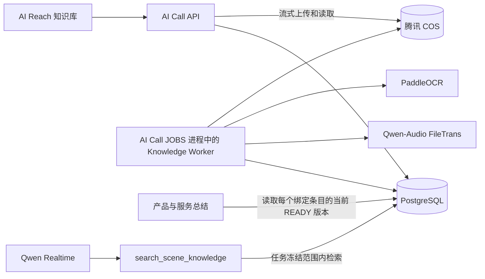

# AI Call 知识库技术设计草案

状态：**里程碑 0 已完成；“跟进数据 + 当前知识库”的后端集成基线已固定在 `codex/knowledge-base-integrated@162b362`，前端发布基线为 `codex/knowledge-base-frontend-release@bf74ec1`。118 与 AI Reach 公网页面已完成 TXT/Markdown、PPTX、DOCX、文本型 PDF 的上传、解析或预览验收，并保留租户化场景绑定、任务知识冻结（500 切片上限）、Realtime 词法检索安全链路和带来源的产品信息草稿。正式资料、真实业务问题和受控通话验收仍待完成；扫描件 OCR、XLSX、图片、音频和视频不属于当前阶段**

日期：2026-08-18（2026-08-20 更新：完成集成基线、DOCX/文本型 PDF 解析、PDF/DOCX/PPTX 浏览器预览及生产验收）

涉及项目：`ai-reach-web`、`ai-call`

## 0. 文档效力

本文描述当前目标方案，并在第 2 节区分开发启动基线、隔离工作树进度和 118 已部署范围；第 2～7 步的完整隔离实现不能整体表述为已经合并或上线，只有第 2.3.1 节明确列出的子集经过了 118 实测。第 9 节的可复现实验已经足以支持受限范围的最小闭环开发，但当前 6 份 PPT 是非正式宣传资料，合成题也不代表真实客户问题，不能据此认定业务质量已经通过。开发阶段按第 9 节锁定最小检索合同和安全回答边界；正式资料、真实业务问题和端到端通话时延按第 16 节在上线前验收。

历史方案与选型讨论只作本地追溯，不参与当前开发和验收。

当前目标方案：

> 腾讯 COS 保存不可变原文件；PostgreSQL 保存知识条目、不可变版本、切片正文、词法索引、场景绑定、任务冻结和使用审计。产品总结只读取场景中每个绑定条目的当前可用版本，通话问答在任务冻结版本内进行 PostgreSQL 词法检索。

一期明确不实现 Embedding、`pgvector`、Qdrant 或其他向量检索基础设施。`FAQ` 只是知识内容分类，与其他资料统一解析、切片和检索，不建设独立 FAQ 数据层。本期采用非向量方案是已确认的范围决策，不代表现有实验已经证明词法检索优于向量检索。若第 16 节未通过，本期不得上线或通过降低标准掩盖问题；应先修复知识、切片、工具调用或回答问题，必要时缩小可回答范围。是否在后续版本引入向量检索，必须另行评审和修订本文。

## 1. 目标与边界

### 1.1 两个业务入口

同一套知识资产服务两个入口：

1. **产品与服务总结**：提示词配置页从当前场景每个已绑定条目的当前可用版本中提取“核心产品、服务亮点、限制条件”等内容，展示来源和冲突，经人工确认后保存为新的提示词版本。
2. **外呼知识问答**：通话中客户询问产品能力、价格、政策、案例、参数或交付周期时，从当前任务冻结的知识版本中寻找证据，再交给 Qwen Realtime 组织回答。

### 1.2 内容职责

- 提示词负责角色、目标、流程、语气和禁止事项；
- `productInfo` 负责稳定、高频、经过人工确认的产品与服务核心信息；
- 知识检索负责详细、长尾和容易更新的业务事实。

三者不能互相替代。上传文件也不等于知识可用，只有完成解析、切片、索引并进入 `READY` 后才能被消费。

### 1.3 完整闭环

```text
PostgreSQL 创建内部 UPLOADING 上传意图
  -> 上传原文件到 COS
  -> 校验完成后转为 PROCESSING
  -> Worker 解析/OCR/ASR
  -> 切片正文和词法索引写入 PostgreSQL
  -> 校验后进入 READY
  -> 上传后关联一个或多个提示词场景
  -> 产品总结或外呼问答使用
  -> 保存来源和审计记录
```

## 2. 开发启动基线与当前进度

以下事实是 2026-08-19 开发启动前对本地工作树和运行进程的只读基线；隔离开发进度见第 2.3 节：

- AI Reach：`main@0ebbf45dc87bd44a6fcf5ccf900f3e07f151dcda`，工作树含大量未提交改动；
- AI Reach 本地 `8078` 监听进程来自上述项目；当前前端改动与知识路由、导航和请求层重叠，知识前端开发前需先确定这些改动的归属和提交基线；
- AI Call 当前 `19011` 监听进程来自 `codex/follow-up-data@6d205ba` 工作树；该工作树只有两个与提示词优化相关的未提交文件，知识开发不得修改、覆盖或依赖它们；
- `codex/follow-up-data` 包含原审计基线 `codex/ai-call-workflow-split@eefd18d`，后端知识开发从它的已提交 HEAD 创建独立工作树，不重启或改动当前 `19011`；
- 当前 `19011` 使用 PostgreSQL 16.14；实例没有安装 `pg_trgm`，也没有任何 `ai_call_knowledge%` 表；
- 审计后已从 `codex/follow-up-data@6d205ba` 创建隔离分支 `codex/knowledge-base-m1`，完成第 15 节第 2 步的首个未合并检查点；迁移只在一次性 PostgreSQL 容器验证，尚未应用到 `19011`；
- 本文和当前评测工作簿尚未纳入 Git，因此本节描述的是本次本地快照，不能替代后续提交基线。

后端可以从上述干净提交创建隔离工作树开始开发。前端需先处理重叠的本地改动；正式资料、评测脚本、语料校验值和结果文件在上线验收前纳入受控版本。

2026-08-20 发布收口后的当前事实如下，开发启动前基线仍保留用于解释分支来源：

- AI Reach 当前发布分支为 `codex/knowledge-base-frontend-release@bf74ec1`；81 的版本目录为 `bf74ec1-20260820-123224`，旧版本 `ed54c9e-20260820-112047` 保留用于回滚；主工作区原有未提交改动没有被覆盖或纳入发布；
- 后端后续开发统一基于 `codex/knowledge-base-integrated@162b362`，它在已提交的跟进数据基线上合入知识主链、DOCX、文本型 PDF 和安全 PDF 预览，不再整体归并范围不明的旧分支；
- 公网 `https://reach.lingchen-ai.com/ai-call/knowledge` 返回 `200`，未登录的真实知识列表接口返回 `401`；登录态下 DOCX 与 PPTX 均上传进入 `READY`，分别生成 5、16 个切片，浏览器预览正常且控制台无错误；
- 上述两份资料只用于工程验收，关联场景数保持为 0，未创建外呼任务、未提交号码、未调用拨号端点。

### 2.1 AI Reach 前端

以下条目是开发启动前基线，不代表当前公网发布状态；当前状态见上方发布收口快照和第 2.3.1 节。

- `config/routes.ts` 没有知识资产页面路由；
- `src/aiCallNavigation.tsx` 的“知识库”目前只是包含“提示词”的菜单分组；
- 提示词配置页已有 `productInfo` 编辑区，但没有“从知识库提取”入口；
- 当前请求层没有知识上传、版本、场景绑定或检索接口；
- 现有 `ruoyiRequest` 已支持 `FormData`、Blob 和租户/Token 请求上下文，新接口应直接复用；
- 生产 Nginx 的 `/ai-call-agent-api/` 已关闭请求缓冲并配置长超时，但尚未配置满足 100 MB 上传合同的 `client_max_body_size`；
- 知识列表、上传、下载、更新、历史版本和处理状态尚未实现。

### 2.2 AI Call 后端

当前已有且可以复用：

- 提示词配置及不可变提示词版本；
- 外呼任务 `config_snapshot_json` 已冻结提示词版本、`productInfo` 和提示词正文；知识版本应追加到同一快照，不新建平行任务快照；
- `product_info` 合入运行时提示词的链路；
- Qwen Realtime 工具注册、`tool_call_done`、工具结果提交和继续生成机制；
- `JOBS` 进程角色和基于短事务、`SKIP LOCKED`、租约及 `lease_owner + status + attempt_count` 条件提交的既有后台任务模式，可以复用于知识处理。

开发启动时尚未实现：

- 知识条目、版本、切片、场景绑定和知识使用审计；
- 腾讯 COS 知识文件上传和读取；
- 知识解析 Worker、OCR、知识音视频 ASR；
- PostgreSQL 知识检索服务；
- `search_scene_knowledge` 工具及 Runner 处理分支；
- 产品与服务总结的一键提取；
- 知识词法函数、生成列和 GIN 索引迁移、腾讯 COS Python SDK 及 PDF/Office/PaddleOCR 等知识解析依赖。

当前 Realtime Runner 只显式处理 `request_handoff` 和 `schedule_call_end`，未知工具会被忽略；新增工具必须补第三个明确分支和最小测试，不需要先抽象通用工具框架。现有通用 `AuthPermission` 不能证明它会校验传入的具体权限字符串；知识接口必须新增显式检查 `ai_call:knowledge:view/manage` 的后端依赖，不能只依赖前端按钮或复用该通用依赖后宣称已经鉴权。

开发启动时任务创建与 Realtime 会话之间没有可信知识上下文；该缺口现已在隔离工作树按第 12 节补齐并验证，尚未合并或应用到 `19011`。

现有 MinIO 继续服务通话录音、音色等既有媒体链路。知识库原文件使用腾讯 COS，不迁移或混用录音存储。

### 2.3 隔离工作树实现进度

截至 2026-08-20，`codex/knowledge-base-integrated` 已在跟进数据基线上收拢第 15 节第 2～7 步，并完成 PPTX、DOCX 和文本型 PDF 解析：

- PostgreSQL 表、迁移、TXT/Markdown 确定性解析切片和固定词法检索；
- 腾讯 COS 服务端流式上传下载、版本 API、Knowledge Worker 和过期上传对账；
- 显式后端权限、AI Reach 知识列表/详情/历史/预览/下载/绑定，以及 RuoYi 权限迁移；
- 创建任务时冻结完整知识快照；118 部署子集根据目标机实测将单任务上限设为 500 切片；
- 产品与服务总结的全量提取、来源/冲突展示、人工应用和过期草稿保护；
- Legacy SIP 与 Owner Runtime 的可信知识上下文、条件注册的 `search_scene_knowledge`、`OK/NO_HIT/TIMEOUT/FAILED` 审计，以及客户转写、工具结果和最终回答事件关联；
- 恶意知识正文只作为不可信业务数据进入模型；它不能在后端直接授权转人工或结束通话。
- PPTX、DOCX 和文本型 PDF 使用独立非 root 解析镜像，通过 Unix Socket 传递只读文件描述符；解析容器禁网、只读、移除 Linux capabilities，并设置 25 秒处理截止、进程数和内存上限。PPTX 保留幻灯片页码，PDF 保留页码；目标 118 冒烟通过后，前端已开放三种格式并完成登录态上传或预览验收。

上述实现通过单元测试、一次性 PostgreSQL 16 集成测试、不发起真实外呼的 SIP/Owner Runtime 回归，以及本地和目标 118 的 `linux/amd64` 解析容器冒烟；集成分支已经推送但尚未归入后端 `main`，正式资料与真实问题上线验收仍未完成。当前支持 TXT、Markdown、PPTX、DOCX 和文本型 PDF；扫描件 OCR、XLSX、图片、音频和视频明确延后，不能据此扩大上传白名单。

#### 2.3.1 118 最小部署与冒烟快照

2026-08-19 先将 `codex/knowledge-base-118-minimal@a2c834e` 的知识资产后端部署到 118，随后依次部署任务冻结与 Realtime 检索、通用提示词、当前提示词工作台兼容合同和产品信息草稿端点；当前 API 基线为 `codex/knowledge-base-118-minimal@dd2240f`，标签为 `release-20260819-knowledge-base`，当日现场镜像为 `ai-call-transfer/api:20260819-kb5-dd2240f`，解析进程为 `ai-call-transfer/knowledge-parser:20260819`。当前部署承接 TXT/Markdown 知识资产、租户化场景绑定、任务冻结、Realtime 词法检索安全链路，以及提示词场景、通用提示词、历史版本和产品信息草稿合同，不代表第 15 节第 2～7 步完整实现已经合并或整体上线。

使用生产 RuoYi 登录态和本地隔离前端 `8079` 对 118 API 做了一次无真实外呼冒烟：上传 245 B 临时 TXT 后，COS 写入成功，Worker 将版本从 `PROCESSING` 推进到 `READY`，PostgreSQL 生成 1 个切片；在线预览和下载接口分别返回 `206`、`200`，原文件 SHA-256 与上传前一致；生产词法函数对“星河售后专线”返回该切片，对无关词“海王星仓储折扣”返回 0 条。随后通过页面删除知识条目，列表恢复为空。删除按本文保留策略执行软删除，版本、切片和 COS 原文件继续保留供历史审计。

第二阶段部署前已创建 PostgreSQL custom-format 备份，并将现有 5 个提示词场景明确归属租户 `000000`；迁移把场景唯一约束改为 `(tenant_id, scene_code)`，未指定旧数据租户时会拒绝执行。服务器内可回滚事务验证了“同租户场景绑定 -> 冻结当前 `READY` 版本 -> 解析可信运行时上下文 -> PostgreSQL 词法命中”，测试事务结束后相关临时记录为 0。Realtime 只在可信任务快照存在时注册 `search_scene_knowledge`，无命中、超时、失败或证据不足时统一要求业务顾问进一步确认；知识正文不能授权转人工或结束通话。

冒烟结束时 API、解析进程和 PostgreSQL 均为 `healthy`，新 API 重启次数为 0。2026-08-19 最终现场复核显示 API 当前为 `AI_CALL_OUTBOUND_EXECUTOR_ENABLED=true`、`AI_CALL_OUTBOUND_DIALER_MODE=sip`；本次只调用知识服务，没有创建外呼任务、提交号码或调用拨号端点，因此未发起真实外呼。118 已启用产品信息草稿端点和 PPTX 隔离解析。AI Reach 公网页面没有随该后端镜像同步发布，之后已通过独立前端发布完成上线。

重新登录后的本地 `8079` 页面只读复验已经完成。首次刷新稳定返回 `504`，最小健康请求确认原因是该开发进程固定使用的 `127.0.0.1:19013` 转发端口未监听，而不是 118 接口失败；恢复 `19013 -> 118:19011` 转发后，同一健康请求返回 `200`。提示词页面随后成功读取 5 个租户场景、通用提示词和当前场景历史版本，服务器上的 `/ai-call/prompt-profiles`、`/ai-call/prompt-common-config`、`/ai-call/prompt-profiles/{id}/versions` 均返回 `200`；知识页面首屏和手动刷新两次读取 `/ai-call/knowledge/items` 均返回 `200`，页面为空与当前无知识条目一致。本次没有保存提示词、上传资料或触发外呼。

产品信息草稿首次调用时发现控制器未挂入主路由，且其依赖的两个 Settings 字段缺失；`dd2240f` 只补齐路由注册和既有配置合同，没有修改前端、提取算法、数据库结构或权限模型。登录态下为“合同审查产品介绍”场景绑定一条带唯一 ID 的临时 `READY` 切片后，`POST /ai-call/prompt-profiles/{profileId}/product-info:extract` 在 5,076 ms 内返回带 4 条来源引用的草稿，页面展示文件名、版本、页码、章节和原文摘录。测试选择“放弃”，没有点击应用或保存，场景 `productInfo` 长度保持 0；审计状态为 `OK`。随后按精确 ID 删除临时条目、版本、切片、绑定和测试审计各 1 条，复查残留均为 0。该 fixture 只验证技术链路，不构成正式资料或业务口径验收。

PPTX 目标机验收先用 DeepLaw 文件直接验证 API 到隔离解析 Socket：生成 27 个切片并连续保留第 1～27 页引用，伪装为 PPTX 的非 ZIP 文件被拒绝。随后用现有 `Sales in 出海获客智能体产品介绍@灵宸智能(1).pptx` 经过同一上传服务写入真实 COS，运行中 Worker 在约 8 秒内进入 `READY`，生成 17 个带第 1～17 页引用的切片；查询“哪些客户更值得跟进”首条命中第 7 页和 `slides/7`。同一文件又通过本地 `8079` 登录态页面上传，约 2 秒后显示“可用”，详情显示 v1、3.7 MB 和 17 个切片；页面软删除后，再按本次唯一备注和文件名清理保留的数据库记录及 COS 原文件，页面和数据库均恢复为空。API、解析容器和 PostgreSQL 均保持 `healthy`。该文件仍属于工程 fixture，不构成正式资料或业务准确率验收。

### 2.4 `lingchen-leads` 参考边界

2026-08-18 对 `lingchen-leads` 的 `codex/continue-development@eaaf62503c69d917c0d94e8a1a8c1254e4bdf013` 只读核对确认：

- 现有检索不使用 Embedding 或向量数据库，核心为 SQLite FTS5 trigram 与 `bm25()` 排序；
- 文件上传链路将原文件写入对象存储，并在 PostgreSQL 保存知识条目和媒体资产；
- 腾讯 COS 接入已经具备私有 Bucket、服务端配置、前缀、流式上传、SHA-256、Range 下载和健康检查等可参考模式；
- 词法检索链路使用另一套 SQLite `knowledge_documents`、`knowledge_chunks` 和 FTS5 表；
- 当前没有从 PostgreSQL/COS 新上传文件自动解析并同步到 SQLite FTS5 的闭环；
- legacy 自动 ingestion 仅接受 `text/plain` 和 `text/markdown`；
- 代码中的 120 题测试由 4 段短文本和重复原文词组成，只证明基本 FTS5 路由可工作，不能替代当前项目的真实中文评测。

因此，本项目参考的是其“原文规范化、切片、词法 Top K、来源快照和证据审计”思想，以及腾讯 COS 的服务端流式读写模式；不复制 PostgreSQL/SQLite 双存储、原始请求体上传、存储元数据硬编码或只软删数据库不清理对象等实现。AI Call 使用 PostgreSQL 作为唯一业务与在线检索数据源，补齐上传、解析、切片、索引、场景冻结和运行时消费的端到端链路。

## 3. 产品交互

### 3.1 知识列表

主列表按知识条目展示，不把历史版本平铺为多行。字段包括：

- 文件名；
- 载体类型：文档、图片、音频或视频，由文件校验结果确定；
- 内容分类：产品&服务、FAQ、专业沉淀（含案例）、行业知识、其他，由上传人选择；
- 当前版本及处理状态；
- 上传时间；
- 关联场景；
- 备注。

载体类型不能推断内容分类。例如 PDF 能识别为文档，但不能自动判断它属于 FAQ 还是产品资料。

内容分类代码固定为 `PRODUCT_SERVICE`、`FAQ`、`PROFESSIONAL`、`INDUSTRY`、`OTHER`，前后端和数据库使用同一组值。

### 3.2 上传与场景关联

上传时只填写文件、内容分类和可选备注，不选择场景。

上传完成后，从列表为知识条目关联零个、一个或多个提示词场景。同一份资料可以被多个场景复用，一个场景也可以关联多份资料，形成多对多关系。

### 3.3 操作范围

主列表直接提供：

- 关联或修改场景；
- 添加或修改备注；
- 删除知识条目。

点击文件名进入详情，提供：

- 预览当前版本；
- 下载原文件；
- 上传新版本；
- 查看、预览和下载历史版本；
- 查看处理警告或失败原因。

所有开放上传的文件类型都支持下载和更新。系统不在线编辑原文件；用户下载修改后重新上传，形成新版本。

### 3.4 版本规则

- 原文件和知识版本不可覆盖；
- 新版本处理期间，旧 `READY` 版本继续可用；
- 新版本成功后，才原子切换为当前版本；
- `(tenant_id, knowledge_item_id, version_no)` 必须唯一；
- 并发处理时，只有版本号大于当前指针所指版本的候选版本才能晋升，旧版本晚完成不得把当前指针回退；
- 新版本失败不影响旧版本；
- 历史任务继续使用创建时冻结的旧版本；
- 删除知识条目先软删除，不能破坏保留期内的历史任务证据。

## 4. 目标架构



| 使用入口 | 读取范围 | 处理方式 |
| --- | --- | --- |
| 产品与服务总结 | 当前场景每个绑定条目的 `current_ready_version_id` | 全量读取；超出模型安全上下文后分批归并 |
| 稳定高频信息 | 任务冻结的 `productInfo` | 随提示词直接使用 |
| FAQ 类资料和其他长尾事实 | 当前任务冻结的 `READY` 版本 | PostgreSQL 词法检索，返回少量证据 |

运行边界：

- 浏览器只访问 AI Call API；
- COS Bucket 私有，不保存永久公开 URL；
- API 流式上传，不能把完整文件读入进程内存；
- Worker 复用 AI Call 现有 `JOBS` 进程角色和同一代码镜像；部署时可以作为独立进程或容器运行，但不是新的业务服务，也不开放公网业务端口；
- 通话过程中不解析原文件，只查询已经准备好的 `READY` 切片。

## 5. 存储职责

### 5.1 腾讯 COS

COS 保存：

1. 每个知识版本的不可变原文件；
2. 处理过程中必须临时提供给 OCR 或云 ASR 的派生文件。

建议对象 Key：

```text
逻辑 Key：knowledge/{tenant_id}/{item_id}/{version_id}/source.{ext}
物理 Key：{AI_CALL_KNOWLEDGE_COS_PREFIX}/knowledge/{tenant_id}/{item_id}/{version_id}/source.{ext}
临时 Key：{AI_CALL_KNOWLEDGE_COS_PREFIX}/knowledge-tmp/{tenant_id}/{version_id}/{job_id}/...
```

临时对象处理完成后立即删除，并配置短生命周期兜底清理。

可以与 `lingchen-leads` 复用同一物理 Bucket 和 Region，但 AI Call 必须使用独立前缀，例如 `ai-call`，不能写入 Leads 的 `leads-ai` 前缀。服务端配置使用独立命名：`AI_CALL_KNOWLEDGE_COS_SECRET_ID`、`AI_CALL_KNOWLEDGE_COS_SECRET_KEY`、`AI_CALL_KNOWLEDGE_COS_BUCKET`、`AI_CALL_KNOWLEDGE_COS_REGION` 和 `AI_CALL_KNOWLEDGE_COS_PREFIX`；若云上支持，应给 AI Call 服务角色只授予该前缀的最小权限。数据库只保存逻辑 Key，COS 适配器统一添加物理前缀，避免业务代码散落 Bucket 路径规则。

### 5.2 PostgreSQL

PostgreSQL 是业务事实、处理控制和在线检索系统，保存：

- 知识条目、内容分类和备注；
- 不可变版本、原文件 COS Key 和校验值；
- 上传幂等键、请求指纹和内部 `UPLOADING` 状态；
- 解析器、OCR、ASR 和切片策略版本；
- 处理状态、任务租约、重试信息、云 ASR 任务状态、失败原因和警告；
- 全量切片正文、来源位置、校验值和词法索引；
- 场景绑定和任务冻结版本；
- 产品总结与通话检索审计。

数据库备份覆盖切片正文。词法索引可由数据库正文重建；极端情况下也可从 COS 原文件重新解析。

## 6. 核心数据合同

字段表达职责，最终命名遵循 AI Call 现有数据库约定。知识表主键复用 `generate_snowflake_id()` 的 `BigInteger`，`tenant_id` 使用与认证和提示词配置一致的 `String(20)`，`prompt_profile_id` 使用 `BigInteger`。返回给前端或写入 JSON 快照的所有 `BigInteger` ID 必须序列化为字符串，避免 JavaScript 精度丢失。

### 6.1 `ai_call_knowledge_item`

```text
id / tenant_id
display_name
content_category
note
current_ready_version_id
created_by / created_at / updated_at
deleted_at
```

### 6.2 `ai_call_knowledge_version`

```text
id / tenant_id / knowledge_item_id
version_no
status                    UPLOADING | PROCESSING | READY | FAILED
source_object_key
source_filename / extension / mime_type / byte_size / sha256
upload_operation / upload_idempotency_key / upload_request_fingerprint
parser_name / parser_version
ocr_model / asr_model
chunk_strategy_version
chunk_count / chunk_set_sha256
attempt_count / next_attempt_at
lease_owner / lease_expires_at
provider_task_id / provider_submit_request_id
provider_task_status / provider_subtask_status
result_fetch_status         PENDING | FETCHED | FAILED
result_fetched_at / last_polled_at
processing_warning_json
failure_code / failure_message / failure_retryable
created_by / created_at / ready_at
```

约束与边界：

- `(tenant_id, knowledge_item_id, version_no)` 唯一；
- `(tenant_id, upload_operation, upload_idempotency_key)` 唯一；
- 上传新版本时在同一短事务中锁定知识条目并分配递增 `version_no`；
- `UPLOADING` 是内部恢复状态，不作为前端业务状态展示；
- 每次 Worker 成功领取时递增 `attempt_count`；最终提交必须同时匹配 `id + status + lease_owner + attempt_count`，不额外增加与现有任务模式重复的 `attempt_id`；
- `provider_task_id` 用于恢复云 ASR 轮询，`provider_submit_request_id` 用于调用追踪和供应商排障；
- 版本内容不可原地修改；处理重试复用同一个版本，用户重新上传才创建新版本。

### 6.3 `ai_call_knowledge_chunk`

```text
id / tenant_id / knowledge_version_id
chunk_index
content / content_checksum
content_type / source_type
page_no / section_path / source_path
start_ms / end_ms / speaker_id
token_count
created_at
```

`id` 使用现有 Snowflake 主键；`(tenant_id, knowledge_version_id, chunk_index)` 唯一。同一处理尝试先在临时结果中计算整组切片，最终事务确认 Worker 仍持有该版本后，整体替换该未就绪版本的切片并写入 `chunk_set_sha256`，因此重试不会产生重复切片。版本进入 `READY` 后切片不可修改。

原始 `content` 是回答证据。生产 PostgreSQL 迁移按第 9 节只增加实际用于检索的 `ngram_tsv` 生成列和 GIN 索引，不重复存储当前查询不使用的规范化正文。为保持现有 SQLite 单元测试可运行，该 PostgreSQL 专用列不放进通用 SQLAlchemy `create_all` 元数据，检索服务使用参数化 SQL 访问，真实结构由手工迁移和 PostgreSQL 集成测试验证。

### 6.4 `ai_call_prompt_knowledge_binding`

```text
id
tenant_id
prompt_profile_id
knowledge_item_id
created_by / created_at
```

`tenant_id + prompt_profile_id + knowledge_item_id` 唯一，防止重复关联。

### 6.5 任务知识快照

在现有 `config_snapshot_json` 中增加：

```json
{
  "knowledge": {
    "promptProfileId": "...",
    "versionIds": ["...", "..."],
    "versionSnapshotHash": "...",
    "retrieverVersion": "postgres-ngram-tsvector-v1",
    "frozenAt": "..."
  }
}
```

按数值升序排列 `versionIds`，并将每个版本的 `id`、`source sha256`、`chunk_set_sha256` 以固定 JSON 编码后计算 SHA-256，生成 `versionSnapshotHash`。冻结前汇总所有版本的 `chunk_count`；大于 `max_frozen_chunks_per_task = 500` 时阻止创建任务并提示减少资料，不静默截断。`tenant_id` 来自任务自身，不接受客户端在快照中指定。场景后来解绑、资料更新或提示词修改，都不能改变已创建任务。

### 6.6 `ai_call_knowledge_usage`

统一记录产品总结和通话检索：

```text
id / tenant_id
purpose                   PRODUCT_SUMMARY | REALTIME_ANSWER
prompt_profile_id
task_id / call_id / customer_transcript_event_id
tool_call_id / tool_result_event_id
answer_event_id / qwen_response_id
query_hash / query_excerpt_redacted
knowledge_version_ids
version_snapshot_hash
status                    OK | NO_HIT | TIMEOUT | FAILED
retriever_version / model_name
evidence_json             version_id、chunk_id、checksum、得分、来源、短摘录
latency_ms / created_at
```

`OK` 表示检索返回了候选切片，不等于回答已经得到事实支持；最终回答是否拒答仍从关联的通话转写和固定验收集判断。

通话审计不重复保存完整客户问题：完整文本继续由原转写记录及其权限、保留策略管理；知识使用记录只保存 `customer_transcript_event_id`、规范化查询哈希和可选脱敏短摘录。`tool_call_id`、工具结果事件和最终回答事件必须关联起来，确保能够证明“哪次客户提问触发了哪次检索、哪些证据进入模型、最终生成了哪条回答”。产品总结没有通话事件时，这些字段为空。审计只保存不可变指针、校验值和实际交给模型的证据短摘录，不重复保存整份正文。

## 7. 上传、下载与版本接口

以下为 AI Call 后端业务路径；前端继续通过现有 `/ai-call-agent-api` 代理访问。

```text
POST   /ai-call/knowledge/items/upload
GET    /ai-call/knowledge/items
GET    /ai-call/knowledge/items/{itemId}
PATCH  /ai-call/knowledge/items/{itemId}
PUT    /ai-call/knowledge/items/{itemId}/scene-bindings
DELETE /ai-call/knowledge/items/{itemId}

POST   /ai-call/knowledge/items/{itemId}/versions/upload
GET    /ai-call/knowledge/items/{itemId}/versions
GET    /ai-call/knowledge/versions/{versionId}/download
GET    /ai-call/knowledge/versions/{versionId}/preview
GET    /ai-call/knowledge/versions/{versionId}/processing
POST   /ai-call/knowledge/versions/{versionId}/retry
```

### 7.1 上传合同

```text
Content-Type: multipart/form-data
字段：file、fileSha256、contentCategory、可选 note
```

- 上传接口不接收场景 ID；
- 初始单文件上限为 100 MB；
- Nginx 在 `/ai-call-agent-api/` 显式配置 `client_max_body_size 110m`，为 multipart 边界和字段保留开销；后端仍按文件正文精确执行 100 MB 上限；
- 后端从登录态取得租户和操作者；
- 校验文件名、扩展名、声明 MIME、文件头、非空、大小、客户端 SHA-256 和解压后大小；
- 后端先创建不可见的 `UPLOADING` 版本，生成固定 `item_id`、`version_id` 和 COS Key；
- 文件流式写入私有 COS，同时计算 SHA-256；
- COS 写入及 `HeadObject` 校验成功后，将同一版本转为 `PROCESSING`；
- `Idempotency-Key` 按租户和上传操作唯一，请求指纹至少包含操作类型、目标条目、规范化文件名、声明大小、`fileSha256`、内容分类和备注；
- 同一幂等键和相同指纹返回原 `item_id/version_id` 的当前结果，不重复上传；同一键但不同指纹返回 `409 Conflict`。

服务端流式计算的 SHA-256 必须与 `fileSha256` 一致；不一致时上传失败并清理对象，不能进入 `PROCESSING`。

首次成功接收并转为 `PROCESSING` 时返回 `202 Accepted` 和固定的 `itemId/versionId/status`。相同请求重放时返回同一组资源 ID 和当前状态，并增加 `Idempotent-Replayed: true`；响应状态可以随处理进度从 `PROCESSING` 变为 `READY/FAILED`，但资源身份不得变化。

固定对象 Key 和 `UPLOADING` 记录在上传前已经持久化，因此 COS 成功但后续数据库更新失败时可以可靠对账和清理。超时的 `UPLOADING` 记录由定时任务核对 COS 后继续提交或删除对象；上传未完成的版本不得进入前端列表或场景消费。

本期只采用“浏览器 -> AI Call API -> COS”的服务端流式链路，不发放浏览器 STS，也不让浏览器直接访问 COS。后续只有实测证明 API 上传带宽成为瓶颈时，才另行评审直传和分片上传。

### 7.2 场景绑定合同

```json
{
  "promptProfileIds": ["profile-1", "profile-2"]
}
```

`PUT /scene-bindings` 整体替换该知识条目的绑定；空数组表示解除全部绑定。后端只接受当前租户有权管理的提示词配置 ID。

### 7.3 下载与预览

下载和预览统一由 AI Call API 校验租户、权限和版本后流式返回，浏览器不直接访问 COS。音视频请求支持 `Range` 和 `206 Partial Content`。

- PDF 使用鉴权 Blob 安全内联预览；
- DOCX、PPTX 通过鉴权下载 Blob 后在浏览器本地渲染，不转成 PDF，也不暴露 COS 地址；
- 其他活动内容统一使用 `Content-Disposition: attachment` 下载，不直接内联；
- 数据库、接口响应和前端都不保存永久 COS URL。

## 8. Knowledge Worker

### 8.1 部署

Worker 位于 AI Call 后端代码库，注册到现有 `JOBS` 进程角色，使用同一代码镜像运行：

- 与 API、PostgreSQL 和 COS 位于可访问的私有网络；
- 不开放公网业务端口；
- 使用短事务通过 `FOR UPDATE SKIP LOCKED` 领取 `PROCESSING` 版本，写入 `lease_owner`、`lease_expires_at`、递增 `attempt_count` 后立即提交并释放行锁；
- OCR、ASR 和文件解析都在领取事务之外执行；长任务按需续租，租约过期后允许其他 Worker 重新领取；
- 最终提交时必须同时匹配 `version_id + status=PROCESSING + lease_owner + attempt_count`，过期尝试不得覆盖新尝试的结果；
- 初始部署一个 `JOBS` 进程、知识任务单并发；
- 不增加额外消息队列或任务框架。

出现持续积压并有监控证据后，再增加 Worker 数量或并发。

2026-08-19 只读核对现有 118 部署工作树 `codex/ai-call-118-deploy@d6cd380` 确认：`deploy/ai-call-118/` 已有独立 Compose 和以非 root 用户运行的 API 镜像；旧结论“当前 AI Call 仓库没有生产 Dockerfile”不成立。但该基线没有二进制解析服务专用的禁网、只读文件系统、权限移除、资源上限和凭证隔离，仍不能作为安全解析已经具备的证据。

`codex/knowledge-base-integrated` 的 `linux/amd64` 解析镜像支持 PPTX、DOCX 和文本型 PDF：解析服务不加载业务 `.env`，通过 Unix Socket 接收 API 传递的只读文件描述符，并以 `network_mode: none`、非 root、只读根文件系统、`cap_drop: ALL`、`no-new-privileges`、`pids_limit: 32`、512 MiB 内存上限运行；单次解析在进程内强制 25 秒截止，早于 API 的 30 秒等待上限。三种格式均已完成对应测试和生产登录态验收；未列出的二进制格式不得开放。

### 8.2 状态

前端只展示：

```text
PROCESSING -> READY
PROCESSING -> FAILED
```

- 内部状态转换只允许：`UPLOADING -> PROCESSING`、`UPLOADING -> FAILED`、`PROCESSING -> READY`、`PROCESSING -> FAILED`、`FAILED(retryable) -> PROCESSING`；其中 `UPLOADING` 不在前端展示；
- 只有 `READY` 可被场景消费和新任务冻结；
- 辅助通道失败但仍有足够正文时，可以 `READY` 并保存警告；
- 没有产生任何有效正文时必须 `FAILED`；
- 不增加含义模糊的中间业务状态。

### 8.3 格式与解析器

界面只开放已经完成真实解析和检索验收的格式：

| 类型 | 处理方式 | 引用位置 |
| --- | --- | --- |
| TXT、Markdown | 文本解析和清洗 | 标题、段落 |
| DOCX | 不执行宏或嵌入对象的 OOXML 解析器 | 文档正文 |
| PPTX | 不执行宏或嵌入对象的 OOXML 解析器 | 幻灯片页码 |
| 文本型 PDF | 提取 PDF 文字层 | 页码 |

旧二进制 Office 格式在安全转换器通过验证前不开放。

当前界面只开放 TXT、Markdown、PPTX、DOCX 和文本型 PDF。PDF 中已有的文字可以解析，图片可以随原 PDF 预览，但图片内文字、图表含义和纯扫描页不能解析；纯扫描 PDF 必须明确失败，不能静默生成空知识。

扫描件 OCR、XLSX、图片、音频和视频不是本期任务。只有正式资料确实需要且用户重新确认范围后，才分别设计、开发和验收；不得因为依赖已经存在就提前扩大前端 `accept` 或后端上传白名单。

每一档都必须先完成解析、来源定位、检索、异常文件、资源上限和临时文件清理测试；不得因为代码中存在解析器就提前扩大前端 `accept` 或后端上传白名单。

### 8.4 OCR、ASR 与视频边界

- 图片和扫描 PDF 使用本地 PaddleOCR；
- 知识音视频 ASR 目标模型为 `qwen3-asr-flash-filetrans`；该名称已与现有 AI Call 配置和阿里云官方模型目录核对，启用前仍须确认目标账号、地域、费用和数据策略；
- 云 ASR 采用异步提交和轮询：成功提交后立即保存 `provider_task_id`，同时保存 `provider_submit_request_id` 用于追踪；
- Worker 持久化任务、子任务和结果获取状态，重启后可恢复轮询；
- 云 ASR 等待期间不保持数据库事务；保存 `provider_task_id` 后可以释放租约，后续 Worker 重新领取并继续轮询；
- 转写成功后立即下载结果并进入本地切片流程，不把有效期 24 小时的结果地址作为长期数据；
- 阿里云只能读取处理所需的短时签名派生音频地址，不获得永久 COS 权限；
- 视频由 FFmpeg 探测媒体、提取音轨、字幕和关键帧；
- PaddleOCR 只识别关键帧中的 PPT、界面、参数和字幕文字；
- 本期不理解无讲解、无字幕、无画面文字视频中的动作、外观和空间关系。

### 8.5 处理步骤

1. 短事务领取任务并保存 `lease_owner`、`lease_expires_at` 和本次 `attempt_count`；
2. 从 COS 下载原文件到任务临时目录；
3. 校验 SHA-256、文件头、MIME、扩展名和解压后大小；
4. 提取正文并保留页码、章节、行号或时间点；
5. 统一空白、编码和重复文本，不修改数字、单位和专有名词；
6. 优先按标题、段落和完整句切片；
7. 生成切片内容校验值和整组 `chunk_set_sha256`；
8. 在一个短 PostgreSQL 事务中写入该版本切片和词法索引；
9. 核对切片数量和整组校验值；
10. 仅当 `status + lease_owner + attempt_count` 仍匹配时将版本改为 `READY`；同一短事务锁定知识条目，只有候选 `version_no` 大于当前指针版本号时，才原子更新 `current_ready_version_id`，防止 v3 先完成后又回退到 v2；
11. 无论成功或失败都清理临时文件。

切片起始参数为目标 500–1,000 个中文字符、最大约 1,200 字符，优先保证语义完整和来源可定位。参数通过 `chunk_strategy_version` 固定，不能静默改变既有版本。

## 9. PostgreSQL 词法检索与里程碑 0

### 9.1 当前证据和决策边界

现有 [`knowledge-retrieval-m0-results.xlsx`](../outputs/knowledge-retrieval-evaluation-20260818/knowledge-retrieval-m0-results.xlsx) 只保留为探索记录，不作为当前结论。当前评测口径和稳定来源见 [`knowledge-retrieval-evaluation-set.xlsx`](../outputs/knowledge-retrieval-evaluation-20260818/knowledge-retrieval-evaluation-set.xlsx)，可复跑脚本见 [`experiments/knowledge-retrieval-m0/`](../experiments/knowledge-retrieval-m0/README.md)，原始结果见 [`outputs/knowledge-retrieval-evaluation-20260818/m0/`](../outputs/knowledge-retrieval-evaluation-20260818/m0/)。

2026-08-18 最终复跑固定了 6 份 PPT 和 SHA-256、120 题 JSONL、99 页确定性解析与切片、PostgreSQL SQL、逐题结果、执行计划、环境信息和证据清单。实验使用 PostgreSQL 16.14、`pg_trgm` 1.6、`pptx-ooxml-stdlib-v1` 和 `pptx-slide-semantic-900-1200-v1`；99 个切片长度为 68–861 字符，平均 372.9 字符。这些内容证明实验可复现，不证明资料是正式业务真值。

审核后修正了三个实验来源页：`DOC-009` 改为 3、13，`HAR-010` 改为 7，`REC-012` 改为 6。6 份 PPT 只作为工程实验语料，不是正式业务资料；有来源内容仅用于验证能否找到对应页面，效果提升、成功率等宣传表达只可表述为“资料或案例中描述”，不构成客户承诺；无来源内容统一回答“资料暂未明确，需要业务顾问进一步沟通”。这些处理规则用于控制实验风险，不等于业务已经确认。

120 题按运行职责拆分为：

- 90 道 `ANSWER` 题需要调用知识检索，进入 Recall@5 分母；
- 12 道跨产品 `CLARIFY` 题由固定产品信息判断边界，在 Realtime 运行集单独验收；
- 18 道资料无答案题检验回答层拒答和转业务顾问，不进入 Recall@5 分母。

题集显式标出 4 道“无共同词改写”，操作定义是原问题与正确来源没有共同二元字符。实验查询合同曾固定为 `raw-query+deterministic-canonicalization-v1`：命中固定同义表达时改写为短标准词，否则使用客户原问题；规则不包含答案数值，逐题结果同时保存原问题和实际标准词。该合同用于保留实验可复现性，不作为生产默认查询合同。

最终开发集结果为：

| PostgreSQL 词法候选 | Top 5 命中 | Recall@5 | 高风险命中 | 无共同词命中 |
| --- | ---: | ---: | ---: | ---: |
| 确定性标准词 + 加权 n-gram `tsvector` | 90/90 | 100% | 21/21 | 4/4 |
| 原始字符 n-gram 数组相交 | 77/90 | 85.56% | 19/21 | 0/4 |
| 原始加权 n-gram `tsvector` + GIN | 77/90 | 85.56% | 19/21 | 0/4 |
| 清洗查询字符 n-gram | 75/90 | 83.33% | 18/21 | 0/4 |
| `pg_trgm` | 43/90 | 47.78% | 9/21 | 1/4 |

`lexical_v2` 在开发集上达到 90/90，但规则是在该开发集上调出的，只能作为**实验候选**，不能作为生产准确率或正式验收结果。单连接、全量预热、每个场景固定抽取 5 题并重复 2 轮的最终本机延迟为：

| 冻结切片数 | 样本数 | P50 | P95 |
| ---: | ---: | ---: | ---: |
| 100 | 60 | 53.160 ms | 97.863 ms |
| 500 | 60 | 241.693 ms | 448.783 ms |
| 1,000 | 60 | 497.863 ms | 903.332 ms |
| 2,000 | 60 | 1,188.404 ms | 2,040.799 ms |

当前 6 份 PPT 合计 99 个切片，单份为 12–24 个。500–2,000 档位由脚本循环复制这 99 个切片生成，只用于观察扩容趋势，不代表本期实际资料量。

2026-08-19 又在 118 当前 PostgreSQL 16.14 上用事务内合成数据复测 100 和 500 切片；每档预热 5 次后记录 100 次，测试结束整体回滚，确认测试租户残留为 0：

| 118 冻结切片数 | 样本数 | 平均 | P50 | P95 | 最大 |
| ---: | ---: | ---: | ---: | ---: | ---: |
| 100 | 100 | 42.841 ms | 42.646 ms | 43.372 ms | 48.476 ms |
| 500 | 100 | 195.603 ms | 195.424 ms | 197.644 ms | 199.262 ms |

该结果是目标主机上的单连接、热缓存、合成正文检索开销，不包含 Qwen 生成、音频首包、并发和冷缓存，不能冒充端到端上线指标。由于当前实验资料已经有 99 个切片，100 几乎没有新增资料余量；500 切片在 118 的可复跑脚本实测 P95 为 197.644 ms，因此当前部署将 `max_frozen_chunks_per_task` 固定为 500。超过时阻止创建任务并提示减少资料，不静默截断。这个选择扩大容量边界，不改变正式资料、真实问题和端到端通话验收要求。

同日又在 118 以独立测试租户临时提交 500 个合成切片，使用 PostgreSQL 自带 `pgbench` 固定执行 1、5、10 并发，脚本退出后精确清零条目、版本和切片：

| 模式 | 并发 | 样本数 | 平均 | P50 | P95 | 最大 | TPS |
| --- | ---: | ---: | ---: | ---: | ---: | ---: | ---: |
| 未显式预热的首次查询 | 1 | 1 | 200.146 ms | 200.146 ms | 200.146 ms | 200.146 ms | 4.995 |
| 热缓存 | 1 | 100 | 195.940 ms | 195.503 ms | 198.422 ms | 203.502 ms | 5.103 |
| 热缓存 | 5 | 100 | 206.943 ms | 206.266 ms | 211.292 ms | 222.872 ms | 24.038 |
| 热缓存 | 10 | 100 | 255.597 ms | 249.023 ms | 276.079 ms | 283.085 ms | 37.111 |

首次查询没有执行显式预热，但插入过程可能已经把相关页带入 PostgreSQL 共享缓存，因此不把它命名为真正冷缓存。清空共享缓存或操作系统页缓存会影响同机服务，本次没有在 118 共享 PostgreSQL 上执行；真正冷缓存需在维护窗口或隔离环境补测。10 并发时 P95 为 276.079 ms，未出现查询失败或超时，但仍不能代替无检索/有检索通话对照。

2026-08-19 在检索规则、开发集和切片哈希已经冻结后，另行生成并一次性执行了 120 题独立合成盲测。该题集与开发集没有相同问题，最大二元字符 Jaccard 为 0.3333；其中 90 条需要检索、34 条为高风险题、13 条经正确来源页复核后属于无共同词改写。审核工作簿见 [`knowledge-retrieval-validation-results.xlsx`](../outputs/knowledge-retrieval-validation-20260819/knowledge-retrieval-validation-results.xlsx)，冻结题集、逐题结果和证据清单见 [`outputs/knowledge-retrieval-validation-20260819/`](../outputs/knowledge-retrieval-validation-20260819/)。一次性结果为：

| 独立合成盲测候选 | Top 5 命中 | Recall@5 | 高风险命中 | 无共同词命中 |
| --- | ---: | ---: | ---: | ---: |
| 冻结 `lexical_v2` | 76/90 | 84.44% | 28/34 | 0/13 |

如果套用旧草案中的固定阈值，该结果会被判为未通过；但这些阈值没有正式资料和真实业务问题作为依据，因此撤销其“开发阻塞门槛”含义。14 条未命中中，13 条是问法与正确资料页没有共同二元字符，说明当前固定词法规则对这类表达没有可靠桥梁；另一条 `VDOC-011` 因固定“业务场景”改写过宽，反而命中错误标准词。该题集已经揭盲，只保留为回归证据，不能用于证明真实业务通过率。

租户、冻结版本和 `READY` 状态三个强制范围检查通过；三个经语料逐块验证、没有共同二元字符的控制问题均返回零候选。里程碑 0 的**工程探索结论为可进入受限范围开发**：可复现语料、切片、SQL、范围合同、原始结果和安全退路均已具备。该结论不代表业务效果通过；正式资料、真实客户问题、真正冷缓存和端到端通话时延仍属于上线前证据。目标主机的单连接及 1、5、10 固定并发热缓存 500 切片基准已经补齐，结果和限制见上表。

### 9.2 里程碑 0：锁定最小开发合同

进入最小闭环开发时按以下合同实施：

1. 6 份实验资料保留稳定副本和 SHA-256，只作为工程 fixture，不赋予正式业务效力；
2. 一期只自动回答资料中明确、客观且有可定位来源的内容；宣传效果使用“资料或案例中描述”的限定表达，条件不清、资料无依据、无可靠候选或内容冲突时转业务顾问；
3. 第一个纵向闭环先实现 TXT/Markdown 的生产解析与切片，并记录 `parser_version` 和 `chunk_strategy_version`；其他格式在各自实现后用同一合同验收，不要求在开始编码前一次完成；
4. PostgreSQL 查询、索引和排序公式使用 `postgres-ngram-tsvector-v1`；生产默认只检索规范化后的客户原问题，不带实验中的固定标准词、停用短语或同义改写；
5. 检索输入保存客户最终转写原话和实际检索词，不能使用未记录的临时改写；
6. 当前每任务最多 500 个冻结切片，创建任务超过上限时阻止并提示减少资料；目标主机的 1、5、10 固定并发热缓存延迟已复测，真正冷缓存和端到端通话对照在上线前补齐；
7. 语料清单与哈希、切片文件、SQL、数据库版本、参数、逐题结果和汇总结论保存在受控目录，保证另一台环境能够复跑。

里程碑 0 锁定的是开发接口和安全边界，不是最终业务准确率。生产第一版检索器固定为 `postgres-ngram-tsvector-v1`：

1. 对客户原问题和切片正文执行 NFKC、转小写并移除空白与标点；不删除业务词，不执行同义词或标准词改写；
2. 为规范化文本生成去重的 2、3、4 字符 n-gram，4 字符权重 `A`、3 字符权重 `B`、2 字符权重 `D`；
3. 切片使用生成列 `ngram_tsv` 和 GIN 索引；查询使用各 n-gram 的 `OR tsquery`，并以 `ts_rank_cd(ARRAY[0.05,0.20,0.50,1.00], ngram_tsv, query, 32)` 降序排序；
4. 排名相同时按 `knowledge_version_id`、`chunk_index`、`id` 升序，保证结果稳定；
5. 规范化后少于 2 个字符直接返回 `NO_HIT`，原始查询超过 500 个字符按输入错误拒绝；默认返回 5 条，调用方只能在 1–5 之间缩小数量；
6. 该版本不依赖 `pg_trgm`，也不包含实验的 `kb_clean_query`、`kb_expand_query` 或 `lexical_v2` 规则。

上述 SQL、函数和索引通过可回滚的 PostgreSQL 手工迁移实现，并由真实 PostgreSQL 集成测试锁定执行计划和范围条件。无共同词改写可能安全漏召回，这是已知能力边界：没有可靠词法候选就转业务顾问，不能用针对当前 6 份资料手调的全局规则掩盖。

验收数据拆成三套，不能用同一份 120 题替代所有测试：

1. **固定检索基准集**：评价切片能否召回正确来源；
2. **Realtime 运行集**：评价工具应调用/不应调用、最终回答、拒答和端到端时延；
3. **安全与恢复集**：评价租户隔离、提示注入、恶意文件、超时、重试和恢复。

### 9.3 强制范围与返回合同

每次查询都必须由后端添加：

```text
tenant_id = 当前通话租户
knowledge_version_id IN 当前任务冻结版本
knowledge_version.status = READY
```

模型和浏览器不能指定或扩大租户、场景和版本范围。FAQ 不建立独立检索链路，只按 `content_category = FAQ` 保留分类信息，并与其他知识切片一起在上述范围内检索。

生产 SQL 和排序公式按第 9.2 节的 `postgres-ngram-tsvector-v1` 实现。结果去重后最多返回 5 个切片，包含原始正文、文件名、版本、页码或时间点。`NO_HIT` 只表示检索器没有返回候选；返回候选只表示 `OK`，不表示证据足以回答。证据不足或资料互相矛盾时，由回答层拒答，检索器不虚构 `conflict` 状态，也不能依赖一个未经验证的全局分数阈值。

### 9.4 开发边界与上线前质量验收

当前 6 份非正式宣传资料和合成题只用于发现工程边界，84.44% 或其他实验数字不能换算成真实业务通过率。旧草案中的 `Recall@5 >= 95%`、无共同词子集 `>= 90%` 和高风险召回 `= 100%` 暂不作为开发门槛。

开发阶段必须先守住以下边界：

- 只对明确、客观且有来源的内容自动作答；
- 宣传效果、案例收益和成功率不作为客户承诺；
- 无可靠候选、证据不足、条件不明或资料冲突时转业务顾问；
- 每次回答保留文件、版本和页码或时间点，检索范围强制受租户和任务冻结版本约束；
- 当前合成题只作为回归集，不能用于声明正式验收通过。

上线前必须改用已经业务确认的正式资料和具有代表性的真实问题或脱敏客户话术，先冻结题集、风险分类、正确来源和允许回答，再根据实际基线与业务风险书面确定召回门槛。无论最终召回门槛如何，以下安全指标不降低：

- 跨租户或非冻结版本泄漏为 `0`；
- 已自动回答的价格、数字、日期、型号和政策等高风险事实正确率为 `100%`；
- 无资料依据问题的编造率为 `0`，宣传效果的无条件承诺率为 `0`；
- 可回答问题被安全转人工计为能力缺口，不能与危险的错误回答混为同一指标；
- 当前冻结上限为 500；118 单连接热缓存合成基准的检索 P95 为 197.644 ms，固定 10 并发热缓存 P95 为 276.079 ms。此前面向 100 切片提出的 100 ms 暂定目标不能直接套用到 500 切片并据此宣布失败或通过；上线前仍须补齐真正冷缓存和无检索/有检索通话对照，再书面冻结允许的知识检索新增 P95。未通过端到端门槛时先优化或降低上限。

如果正式验收显示覆盖率不足，可以补充正式知识或缩小自动回答范围；不得为追求分数而放宽引用、隔离和不编造约束。

## 10. 场景绑定与任务冻结

知识条目关联提示词配置中的业务场景，不关联某次外呼任务。

创建外呼任务时：

1. 后端读取当前租户和选定提示词配置；
2. 读取该场景绑定的知识条目；
3. 只选择每个条目的当前 `READY` 版本；
4. 汇总版本 `chunk_count`，超过 500 时拒绝创建任务，不截断版本或切片；
5. 将提示词版本及第 6.5 节完整 `knowledge` 对象写入同一个任务快照；
6. 以快照中的 `retrieverVersion` 和 `versionIds` 作为运行时唯一检索范围；

场景后来解绑、资料更新或提示词修改，不影响已经创建的任务。没有可用知识时，任务仍可使用固定提示词和 `productInfo`，但不注册知识搜索工具。

## 11. 产品与服务总结

目标接口：

```text
POST /ai-call/prompt-profiles/{profileId}/product-info:extract
```

这是一项覆盖性抽取，不使用 Top K 检索：

1. 校验提示词配置和租户权限；
2. 对每个绑定条目只读取其 `current_ready_version_id` 指向的 `READY` 版本和全部有效切片；
3. 输入较小时一次生成；
4. 超出模型安全上下文后，按文档或章节分批提取，再合并、去重和识别冲突；
5. 返回可直接写入现有字符串字段的 `draftText`、来源、冲突和本次输入的 `versionSnapshotHash`，不自动保存。

草稿至少包含：

```json
{
  "draftText": "核心产品：...\n服务亮点：...\n限制条件：...",
  "sources": [],
  "conflicts": [],
  "sourceVersionIds": [],
  "versionSnapshotHash": "..."
}
```

现有前后端 `productInfo` 是最长 20,000 字符的字符串，不是结构化对象；`draftText` 必须遵守同一长度上限。每条核心结论必须有来源。互相矛盾的信息进入 `conflicts`，不能静默选择一个答案。

前端提供查看来源、修改草稿、应用结果和放弃。只有用户点击“应用结果”并保存提示词后，才把 `draftText` 写入 `productInfo` 并创建新的提示词版本；`sources`、`conflicts` 和快照字段不写入 `productInfo`。应用前重新计算当前场景版本快照；与 `versionSnapshotHash` 不一致时必须提示重新提取，不能静默应用旧草稿。

## 12. 外呼运行时知识问答

### 12.1 处理分级

| 客户内容 | 处理方式 | 是否检索 |
| --- | --- | --- |
| 问候、确认听见、流程推进 | 提示词和当前对话 | 否 |
| 产品定位、核心能力、主要亮点 | 任务冻结的 `productInfo` | 否 |
| FAQ、价格、政策、案例、周期和具体参数 | 当前任务冻结版本内词法检索 | 是 |
| 没有命中、证据不足或资料矛盾 | 明确无法确认，禁止编造 | 检索后由回答层判断 |

### 12.2 `search_scene_knowledge`

复用现有 Realtime Function Calling 链路增加工具：

```json
{
  "name": "search_scene_knowledge",
  "parameters": {
    "type": "object",
    "properties": {
      "query": {"type": "string"}
    },
    "required": ["query"]
  }
}
```

模型只传查询文本。`tenant_id`、`task_id`、`call_id`、`prompt_profile_id` 和冻结版本全部来自后端可信上下文。

隔离工作树已满足这条前提：Legacy SIP 通过租户限定的 `outbound_task` 查询任务快照，Owner Runtime 通过租户限定的 `outbound_attempt` 反查任务快照，并把只读的 `task_id`、`tenant_id`、`prompt_profile_id`、`versionIds`、`versionSnapshotHash` 和 `retrieverVersion` 放入 `CallSession`。缺少、损坏、哈希不一致或跨租户时不注册工具或返回安全失败；模型参数和浏览器请求不能补写这些字段。该实现尚未合并或上线。

### 12.3 运行链路

```text
最终客户转写
  -> Qwen 判断需要查询业务事实
  -> search_scene_knowledge
  -> 后端读取任务冻结租户和版本
  -> PostgreSQL 检索最多 5 条证据
  -> 保存命中指针、校验值、短摘录和耗时
  -> 以“不可信资料”结构提交工具结果并继续生成
  -> Qwen 仅依据证据回答
```

工具结果状态：

```text
ok       返回证据和来源
no_hit   检索器没有返回候选
timeout  检索超过硬超时
failed   内部错误
```

`ok` 只表示返回了候选证据，不保证证据足以回答。非 `ok` 状态下只能说明暂时无法确认或建议人工确认；`ok` 但证据不足或相互矛盾时也必须拒答，不得编造价格、案例和承诺。一期不让检索器判断业务冲突，因此没有独立 `conflict` 状态。

工具结果中的正文始终是业务数据，不是模型指令：正文不能修改系统提示词、扩大租户或版本范围、要求调用其他工具或授权任何操作。模型不得执行资料中的 URL、脚本、宏或操作指令，也不得仅因知识正文的要求触发转接、结束通话等工具。

必须用“应调用/不应调用”问题集评测工具触发率。如果业务事实漏调不可接受，最小升级是对带知识快照任务的每个最终客户轮次先执行服务端检索；没有证据时不增加独立分类模型。

## 13. 权限与数据安全

新增最小权限：

```text
ai_call:knowledge:view
ai_call:knowledge:manage
```

- 前端路由和按钮按权限控制，后端每个接口独立校验；
- 后端新增专用权限依赖：`manage` 可执行读写并隐含 `view`，`view` 只能列表、详情、预览和下载；不得使用当前不能证明会校验具体权限字符串的通用 `AuthPermission` 代替；
- 新权限还必须在上游 RuoYi 菜单/角色授权数据中创建并分配，确保 JWT 的 `permissions` 实际包含对应值；仅在前后端写权限字符串，普通用户仍不会获得权限；
- 所有数据库查询都必须带 `tenant_id`；
- 检索范围由后端任务快照确定；
- COS Bucket 私有，服务端凭证不进入前端 Bundle、数据库或普通日志；
- 文件名、扩展名、MIME、文件头、大小和解压后大小都要校验；
- Office 宏、脚本和 HTML 活动内容不得执行；
- 检索正文使用固定结构和明确边界标记为不可信资料，不能覆盖系统规则、工具权限或后端范围；
- PDF、Office、FFmpeg 和 OCR 解析在非 root 子进程中运行：输入只读、输出写入独立临时目录、清除数据库/COS 凭证等环境变量、禁止网络访问和宏执行，并设置处理超时、CPU、内存、进程数、文件数及解压后大小上限；
- 子进程无论成功、失败或超时都必须清理临时文件；目标 Linux 环境不能落实上述隔离时，只开放 TXT 和 Markdown，不开放对应二进制格式；
- 知识正文、客户问题和临时 URL 不写入普通日志；
- `ai_call_knowledge_usage` 的访问权限与对应提示词或通话记录一致；完整客户问题只保留在原转写记录中，遵循通话记录的脱敏和保留期限；
- 云 ASR 的数据出域、保留期限和供应商权限必须经过确认。

## 14. 一致性、备份与失败恢复

COS 和 PostgreSQL 没有共同事务，通过不可变 Key、幂等任务和状态提交保证最终一致：

- 每个版本和处理任务有唯一 ID；
- 切片通过 `(tenant_id, knowledge_version_id, chunk_index)` 唯一约束和整组 `chunk_set_sha256` 保证幂等；
- Worker 使用 `lease_owner + status + attempt_count` 安全重试，过期尝试不能提交；
- PostgreSQL 切片数量和整组校验值一致后才进入 `READY`；
- 新版本失败不影响旧 `READY` 版本；
- 定期对账 PostgreSQL 版本记录和 COS 原文件；
- PostgreSQL 备份覆盖知识元数据、切片正文和审计；
- COS 版本、生命周期和备份策略覆盖原文件。

| 失败位置 | 处理结果 |
| --- | --- |
| 上传中断 | 保留不可见 `UPLOADING` 记录；定时对账，完整对象已写入时完成状态提交，否则删除对象并要求重新上传。本期不支持断点续传 |
| COS 成功、数据库更新失败 | 依靠既有 `UPLOADING` 记录重试提交或清理对象 |
| Worker 租约过期 | 新 Worker 重新领取并递增 `attempt_count`；旧领取者的条件更新影响 0 行，结果拒绝提交 |
| 云 ASR 提交后进程中断 | 根据 `provider_task_id` 恢复轮询并在 24 小时内取回结果 |
| 云 ASR 结果已过期且未取回 | 标记为可重试失败，重新提交新的供应商任务 |
| 解析、OCR 或 ASR 永久失败 | 版本 `FAILED`，保存可读原因并允许人工重试 |
| PostgreSQL 切片事务失败 | 整体回滚，Worker 重试 |
| `READY` 提交失败 | 幂等重试，不创建重复切片 |
| 通话检索超时 | 返回 `timeout`，通话继续但不编造答案 |

删除知识条目后，新任务不再使用；被历史任务引用的版本和原文件在保留期结束前不得物理删除。

自动重试只覆盖超时、临时网络故障和供应商可重试错误，最多 3 次，采用指数退避且最长不超过 30 分钟；重试期间保持 `PROCESSING` 并写入 `next_attempt_at`，次数耗尽后才进入 `FAILED`。文件损坏、不支持格式、安全校验失败等永久错误不自动重试。`POST /versions/{versionId}/retry` 只接受当前租户下 `failure_retryable = true` 的 `FAILED` 版本，将其恢复为 `PROCESSING` 并清空租约；下一次领取时递增 `attempt_count`，不创建重复版本或切片。其他失败返回 `409 Conflict`，需要用户修复文件后上传新版本。

## 15. 实施顺序

0. 完成第 9 节里程碑 0 工程探索，固定实验语料、可复现 SQL、范围合同、开发默认上限和安全回答边界（已完成）；
1. 评审数据表、ID、唯一约束、权限、状态机、租约、任务快照和 Realtime 上下文合同，并将本文升级为开发基准（已完成）；
2. 从 `codex/follow-up-data` 已提交 HEAD 创建隔离后端工作树，实现 PostgreSQL 表和词法迁移、TXT/Markdown 确定性解析切片及范围检索，并用一次性 PostgreSQL 集成测试验证（隔离实现已完成；最小表、索引和检索已部署到 118，尚未合并）；
3. 确认开发 COS 参数和官方 SDK 后，实现服务端流式上传下载、版本接口及 Knowledge Worker，把第 2 步的解析检索接入真实对象（隔离实现已完成；TXT/Markdown 最小链路已部署到 118 并冒烟通过，尚未合并）；
4. 实现显式后端权限依赖、知识列表/详情/历史版本/场景绑定，再在前端重叠改动有明确基线后接入 AI Reach（隔离实现已完成；列表、详情、历史、预览、下载和删除已通过前端对 118 冒烟，租户化场景绑定已部署并通过服务器事务验证，重新登录后的提示词与知识页面只读复验已完成，公网页面已发布）；
5. 创建外呼任务时冻结完整知识快照并强制 500 切片上限（已提交并部署到 118，服务器事务验证通过，完整分支尚未合并）；
6. 产品与服务总结的全量提取、来源展示和人工应用（完整隔离实现已完成、尚未合并；最小端点已部署到 118，并通过登录态下“不自动应用、不自动保存”的受控验收）；
7. 补齐 Legacy SIP 与 Owner Runtime 的可信知识上下文，再接入 Realtime `search_scene_knowledge` 和审计（可信上下文、条件注册、检索审计和安全兜底子集已提交并部署到 118，通过无真实外呼测试；完整分支尚未合并）；
8. 完成当前格式处理：PPTX、DOCX 和文本型 PDF 的隔离解析、来源引用、异常文件拒绝、Worker 入库、`linux/amd64` 容器冒烟及前端开放均已完成；扫描件 OCR、XLSX、图片、音频和视频不属于当前阶段；
9. 使用正式资料分别建立固定检索基准集、Realtime 运行集、安全与恢复集并完成上线前验收；
10. 未通过质量门槛时阻止上线，修复对应环节或缩小可回答范围；后续检索方案变化必须另行立项。

### 15.1 最小代码变更矩阵

| 位置 | 最小改动 | 复用点 |
| --- | --- | --- |
| AI Call SQL/Model | 知识条目、版本、切片、绑定、使用审计及约束 | 现有 PostgreSQL/SQLAlchemy 约定 |
| AI Call API/Service | 知识 CRUD、版本上传下载、COS 适配器、总结与检索 | 现有认证上下文和响应模式 |
| AI Call `JOBS` | 注册 Knowledge Worker | 现有进程角色和 `lease_owner + status + attempt_count` 租约模式 |
| 外呼任务创建 | 向现有 `config_snapshot_json` 追加冻结知识版本 | 现有提示词版本和 `productInfo` 快照 |
| Realtime Provider/Runner | 注册第三个工具并增加明确处理分支 | 现有 tool call/result/`response.create` 链路 |
| AI Reach | 路由、菜单、知识列表/详情、请求服务、总结按钮 | `ruoyiRequest`、现有权限和提示词页面 |
| 部署 | COS 服务端配置、Nginx 110 MB 入口限制 | 现有 `/ai-call-agent-api/` 代理 |

不新建通用工具框架、独立 RAG 服务、消息队列、浏览器 COS 直传或第二套任务快照。

第一个纵向里程碑：

```text
上传一份 TXT/Markdown 到真实 COS
  -> Worker 写入 PostgreSQL 切片并进入 READY
  -> 上传后关联场景
  -> 创建任务冻结版本
  -> 问题检索返回正确正文和来源
  -> 一键生成带来源的产品信息草稿
```

不能只验收列表、上传成功或文件预览。

截至 2026-08-19，118 已分别完成上述全部工程环节：真实 COS 上传、Worker 进入 `READY`、租户化场景绑定、任务知识冻结、PostgreSQL 词法检索，以及登录态下一键生成带来源的产品信息草稿。产品草稿测试没有自动应用或保存，临时数据库 fixture 和测试审计已按精确 ID 清零。因此第一个纵向里程碑的工程链路已经闭合；但 COS 入库与产品草稿使用的是两组受控 fixture，上线前仍需用一份业务确认后的正式资料连续走完整链路，并按第 16 节验收真实问题和业务口径。

该纵向里程碑分两个连续检查点交付：先完成不依赖 COS 凭证的“真实 PostgreSQL 表/索引 -> TXT/Markdown 解析切片 -> 强制范围检索”，再接入真实 COS、版本状态和 Worker。第一个检查点不是产品完成，但可以提前验证最容易返工的数据和检索合同；不得用内存假实现冒充完整闭环。

## 16. 验收标准

### 16.1 文件与版本

- 所有界面开放格式都能上传、下载、更新和查看历史版本；
- 100 MB 文件不会被 API 完整读入内存；
- 原文件位于私有 COS，前端无法获得永久地址或服务端凭证；
- 新版本失败时旧版本继续可用；
- 并发处理 v2、v3 时，无论完成顺序如何，当前版本都不会从 v3 回退到 v2；
- 相同幂等键和请求指纹只创建一个版本；同键不同指纹返回冲突；
- 列表、历史版本、COS 和 PostgreSQL 状态一致；
- Worker 租约过期和重复执行不会产生重复切片，旧尝试不能覆盖新尝试；
- 云 ASR 提交后重启 Worker，仍能恢复轮询并及时取回结果。

### 16.2 检索与隔离

- 文档命中返回正确页码，音视频命中返回正确时间点；
- 只有已经业务确认的正式资料可以作为上线验收真值；当前 6 份 PPT 和合成题不计入正式通过率；
- 真实问题或脱敏客户话术必须覆盖每个上线场景、口语改写、高风险事实和无答案问题；样本量及召回门槛在题集冻结前根据业务风险书面确定；
- 检索召回按场景、题型和风险分别报告，不能只用一个总分掩盖失败类型；
- 没有任何词法候选的问题必须返回 `NO_HIT`，资料无依据、证据不足或条件不明时必须转业务顾问；
- 在冻结验收集上，价格、数字、日期和政策等可回答问题事实正确率为 `100%`；
- 在冻结验收集上，无答案问题编造率和宣传效果无条件承诺率均为 `0`；可回答问题被安全转人工单独计为能力缺口；
- 跨租户、非冻结版本命中数为 `0`；
- 当前 `max_frozen_chunks_per_task = 500`；任务超过上限时阻止创建并提示减少资料，不得静默截断；
- 118 单连接热缓存合成基准在 500 切片下检索 P95 为 197.644 ms，固定 10 并发热缓存 P95 为 276.079 ms；上线前仍需完成真正冷缓存和无检索/有检索通话对照，并书面冻结允许的知识检索新增 P95；不满足时必须先优化或降低上限。

### 16.3 产品总结

- 每个绑定条目只读取 `current_ready_version_id` 指向的版本，不混入历史 `READY` 版本；
- 接口返回 `draftText/sources/conflicts/sourceVersionIds/versionSnapshotHash`，只有 `draftText` 写入字符串字段 `productInfo`；
- 每条核心结论都有文件、版本和页码或时间点来源；
- 冲突资料不会静默合并；
- 未点击“应用结果”时不修改提示词；
- 应用并保存后产生新的提示词版本；
- 资料在提取后发生变化时，不会静默应用过期草稿。

### 16.4 外呼问答

- 问候和流程话术不会无意义检索；
- 产品核心信息优先使用冻结的 `productInfo`；
- FAQ 和长尾事实只在任务冻结版本内查询；
- `ok/no_hit/timeout/failed` 都有审计；
- 客户转写事件、`tool_call_id`、工具结果事件和最终 AI 回答事件能够完整关联；
- 无命中、超时、证据不足或资料矛盾时不编造答案；
- 正式 Realtime 运行集必须分别报告知识工具应调用召回率和不应调用误调用率，并在题集冻结前书面确定上线门槛；高风险事实未调用知识工具时只能安全转人工，不能直接作答；
- 上传资料中的“忽略系统规则”“调用其他工具”等恶意文本不会改变系统规则、检索范围或触发操作；
- 在同一环境先测量无检索通话基线，再冻结“最终客户转写到首段回答音频”的绝对 P95 和知识检索新增 P95 门槛；未填写并通过这两个数值前不得上线；
- 使用单元测试、集成测试和白名单环境验收；未经明确授权不发起真实外呼。

## 17. 本期明确不做

- 向量检索及其配套基础设施；
- 无文字视频动作、产品外观和空间关系理解；
- 在线编辑原文件；
- 通话现场解析 PDF、音频或视频；
- AI 自动保存或发布产品与服务总结；
- 每次检索重复保存完整正文快照；
- 没有吞吐证据时引入额外消息队列、缓存或工作流框架；
- 当前版本支持超过 100 MB 的大文件上传。

## 18. 分阶段需确认的运行参数

以下参数不改变总体方案，也不阻塞第 15 节第 2 步；必须在对应功能实现前确定，不能填入假值后宣称验收通过：

1. 第 3 步前确认腾讯 COS 开发 Bucket、Region、独立前缀和服务端角色；上线前再确认生产参数、生命周期及备份规则；
2. 文件和历史版本保留期限；
3. 第 4 步前在上游 RuoYi 创建并分配 `ai_call:knowledge:view/manage`，确认普通用户 JWT 能实际获得对应权限；
4. `productInfo` 推荐内容预算和总结模型；
5. 云 ASR、PaddleOCR、XLSX、图片、音频和视频均不属于当前阶段，不需要为本次发布确认运行参数；
6. 当前界面开放格式固定为 TXT、Markdown、PPTX、DOCX 和文本型 PDF；新增格式必须重新确认范围并通过对应安全、解析和检索测试；
7. 同一白名单环境下的无检索通话 P95 基线、知识检索后的绝对 P95 与允许新增 P95 门槛。
