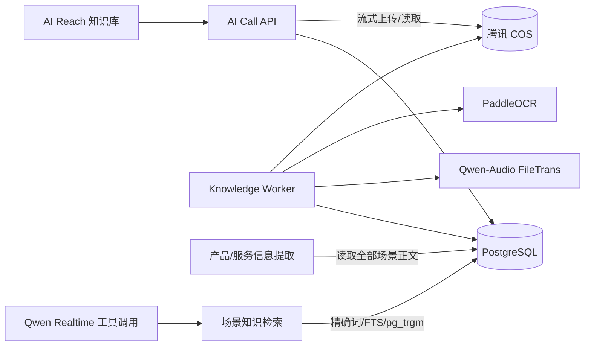

# AI Call 知识库技术方案调研归档

> 状态：**非规范性历史资料，不作为开发与验收依据**
>
> 当前正式方案见 [`2026-08-18-ai-call-knowledge-base-technical-design.md`](./2026-08-18-ai-call-knowledge-base-technical-design.md)。
>
> 本文完整保留方案演进过程中的对象存储、切片包、词法检索、向量检索和音视频处理讨论，供后续技术选型追溯。

---

# 原稿：AI Call 知识库、产品总结与外呼知识问答技术设计

状态：**规范性设计，开发与验收的唯一基准**

日期：2026-08-18

涉及项目：`ai-reach-web`、`ai-call`

## 0. 文档效力

本文把已确认的产品需求、当前代码事实和目标技术方案合并为一份可编码合同。除非明确写为“当前已实现”，其余内容均为**目标设计，尚未落地**。

本文覆盖并修正以下旧结论：

- `2026-08-14-ai-call-prompt-config-design.md` 中“第一版不接知识库”；
- `2026-08-17-knowledge-video-ingestion-design.md` 中与本设计冲突的切片存储与检索表述；
- 本文早期版本中“默认生成 Embedding、部署 Qdrant、产品总结使用 Top K 检索”的方案；
- `2026-08-18-rag-chunk-storage-research.md` 中以 Qdrant 为既定前提的部分。

检索重新评估依据见 `2026-08-18-small-scene-retrieval-reassessment.md`。OCR、ASR 的技术依据见 `2026-08-17-paddleocr-asr-version-selection.md`。这些文件是非规范性依据，不能覆盖本文。

当前唯一目标方案是：

> 腾讯 COS 保存不可变原文件和每版本一份标准化切片包；PostgreSQL 保存知识条目、不可变版本、在线切片正文、词法索引、场景绑定、任务冻结和审计证据；产品总结读取场景全部资料，通话长尾问答先使用 PostgreSQL 词法检索。当前不生成 Embedding，不部署 Qdrant。

Embedding 和专用向量数据库不是当前依赖。只有真实问题集证明词法检索不达标，才按第 9.4 节升级；届时必须修订本文，不能在实现中静默增加另一套架构。

## 1. 问题本质与成功标准

知识库不是“上传文件列表”。当前闭环必须包含：

```text
上传不可变原文件
  -> 异步解析/OCR/ASR
  -> 标准化与切片
  -> 写入 PostgreSQL 词法索引
  -> 校验后进入 READY
  -> 绑定提示词场景
  -> 产品总结或通话知识问答
  -> 模型基于证据生成
  -> 保存来源和审计记录
```

同一套知识资产服务两个入口：

1. **提示词配置**：读取当前场景绑定的全部 READY 资料，生成“产品/服务信息”候选，展示来源和冲突，由用户确认后保存新提示词版本。
2. **外呼运行时**：客户询问产品能力、价格、政策、案例、参数或交付周期时，在任务冻结的知识版本内查找证据并回答。

三类内容职责不同：

- 提示词：角色、任务、流程、表达规则和禁止事项；
- 产品/服务信息与已确认 FAQ：稳定、高频、经过人工确认的核心事实；
- 知识检索：详细、长尾和经常变化的事实。

RAG 的本质是“检索外部证据后再生成”，不等于必须使用向量。当前规模是每场景少量资料，先用更简单、可审计的词法检索。

## 2. 当前代码已实现事实

### 2.1 AI Reach 前端

- `config/routes.ts` 当前没有知识资产页面路由；
- `src/aiCallNavigation.tsx` 的“知识库”只是菜单分组，子项只有“提示词”；
- `src/pages/aiCallLab/promptConfig/index.tsx` 已有“产品 / 服务信息”编辑区，但没有“从知识库提取”入口；
- `src/services/ruoyi/ai-call-lab.ts` 没有知识上传、版本、绑定或检索接口；
- 当前尚未实现知识列表、上传、下载、更新、历史版本和处理状态。

### 2.2 AI Call 后端

当前已有且可以复用：

- `ai_call_prompt_profile` 已按 `tenant_id + scene_code` 隔离；
- `ai_call_prompt_profile_version` 保存不可变提示词快照；
- 创建外呼任务时，`config_snapshot_json.prompt` 锁定提示词内容和版本；
- `product_info` 当前最大 20,000 字符，并会被合入 Realtime 指令；
- Qwen Realtime Provider 已支持工具注册、`tool_call_done`、`submit_tool_result` 和继续 `response.create`；
- Runner 当前只处理 `request_handoff` 和 `schedule_call_end`。

当前尚不存在：

- 知识条目、知识版本、切片、场景绑定和检索审计数据模型；
- 腾讯 COS 知识文件上传与读取链路；
- 知识解析 Worker、PaddleOCR、知识音视频 ASR；
- PostgreSQL 词法索引和检索服务；
- `search_scene_knowledge` 工具及处理分支；
- “产品/服务信息”从知识库一键提取。

当前 MinIO 用于通话录音和音色等既有媒体链路，不是知识库源文件存储。知识库使用腾讯 COS，不迁移或混用现有录音存储。

### 2.3 `lingchen-leads` 参考边界

`lingchen-leads` 已验证以下模式可以工作：文件校验、私有对象存储、约 1,200 字符切片、中文 trigram 词法检索、范围过滤、检索证据快照和内容生成消费。

但它当前的 PostgreSQL/COS 上传链与 SQLite ingestion/FTS5 检索链没有自动接通，不能复制整套实现。本项目只参考其模式和测试方法：

- 使用 PostgreSQL，不引入 SQLite；
- 上传后自动进入同一条解析与索引链；
- 用场景冻结版本替代客户端自由选择知识 ID；
- 使用真实客户问题评测，不采用重复原文关键词组成的合成 Recall 数据作为业务验收。

## 3. 已确认的产品范围

### 3.1 知识列表

列表展示逻辑知识条目，不把每次更新平铺成多行。字段包括：

- 文件名；
- 载体类型：依据 MIME、扩展名和文件头识别，如文档、图片、音频、视频；
- 内容分类：上传人选择，取值为产品&服务、FAQ、专业沉淀（含案例）、行业知识、其他；
- 当前版本及处理状态；
- 上传时间；
- 关联场景：对应提示词配置中的一个或多个业务场景，不关联某次外呼任务；
- 备注。

载体类型和内容分类不能混用。PDF 可以自动识别为文档，但系统不能可靠判断它属于 FAQ 还是产品资料，因此上传时必须选择内容分类。

上传时不要求选择场景，知识条目可以先保持未关联。上传完成后再从列表关联一个或多个场景；同一份资料可被多个场景复用，一个场景也可关联多份资料，形成多对多关系。

### 3.2 列表和详情操作

主列表只直接提供：

- 关联或修改场景（可多选）；
- 添加或修改备注；
- 删除知识条目。

点击文件名进入详情抽屉，提供：

- 预览当前版本；
- 下载原文件；
- 上传新版本；
- 查看历史版本。

下载和更新适用于所有允许上传的文件类型。文件内容不在系统内直接编辑；用户下载、修改后重新上传，形成新版本。

### 3.3 版本规则

- 主列表显示当前 READY 版本；
- 新版本处理中时，旧 READY 版本继续可用；
- 新版本只有处理成功后才原子切换为当前版本；
- 历史版本在详情抽屉展示，可预览、下载和查看失败原因，不可原地编辑；
- 历史任务继续使用创建时冻结的旧版本；
- 删除知识条目只阻止新绑定和新任务使用，保留期内不得破坏历史任务证据。

### 3.4 视频能力边界

本设计不接入 VLM，也不处理多模态视频 Embedding。

视频只处理：

- FFmpeg 提取音轨，ASR 转成带时间点的文字；
- 提取 SRT/WebVTT 或视频内嵌文本字幕；
- FFmpeg 抽取场景变化帧和低频采样帧，PaddleOCR 识别 PPT、界面、参数和烧录字幕文字；
- 将 ASR、字幕和 OCR 结果按时间线去重合并。

系统不能可靠回答无讲解、无字幕、无画面文字视频中的动作、外观、空间关系或操作步骤。界面必须明确提示，不能生成猜测性知识。

## 4. 目标总体架构



两个入口不能共用错误的检索方式：

| 入口 | 数据范围 | 当前方式 |
| --- | --- | --- |
| 产品/服务信息一键提取 | 当前场景全部 READY 版本 | 全量读取；超出安全上下文后按文档/章节分批归并 |
| 通话高频问题 | 已确认 `productInfo` 和小型 FAQ | 随任务提示词直接使用，不检索 |
| 通话长尾事实 | 当前任务冻结的 READY 版本 | PostgreSQL 词法检索 Top K |

运行边界：

- 浏览器只访问 AI Call 业务 API，不直接访问 PostgreSQL；
- COS Bucket 私有，数据库和前端不保存永久公开 URL；
- API 上传必须流式转发，禁止把完整文件读入进程内存；
- Worker 是独立后台进程，不开放公网业务端口；
- 解析、OCR、ASR、切片和索引全部离线完成，通话过程中只查询 READY 切片；
- 当前没有 Embedding API、向量库或 GPU 依赖。

## 5. 存储职责

### 5.1 腾讯 COS

COS 保存：

1. 每个知识版本的不可变原文件；
2. 每个知识版本的一份标准化 `chunks.jsonl`；
3. 处理中的临时音轨、图片帧等派生文件，按短生命周期自动清理。

建议对象 Key：

```text
knowledge/{tenant_id}/{item_id}/{version_id}/source.{ext}
knowledge/{tenant_id}/{item_id}/{version_id}/chunks.jsonl
knowledge-tmp/{tenant_id}/{version_id}/{job_id}/audio.wav
knowledge-tmp/{tenant_id}/{version_id}/{job_id}/frames/{timestamp_ms}.jpg
```

`chunks.jsonl` 是每个版本一个可迁移、可审计、可重建的标准化切片包，不是每个切片一个文件。它不参与在线查询；在线查询使用 PostgreSQL。

每行保存一个独立 JSON 对象，最小合同为：

```json
{"schema_version":1,"knowledge_item_id":"...","knowledge_version_id":"...","chunk_id":"...","chunk_index":0,"content":"标准交付周期为7个工作日。","content_type":"product_service","source_type":"pdf_text","page_no":12,"start_ms":null,"end_ms":null,"content_checksum":"..."}
```

文档填写页码和章节，音视频填写开始/结束时间，CSV/JSON 填写行号或 Path。切片包写入临时 Key，完成校验后才提交正式 Key。

### 5.2 PostgreSQL

PostgreSQL 是业务事实、处理控制和在线检索系统，保存：

- 知识条目、内容分类和备注；
- 不可变知识版本及当前 READY 版本指针；
- 原文件和 `chunks.jsonl` 的 COS Key、大小、MIME、校验值；
- 解析器、OCR、ASR 和切片策略版本；
- 处理状态、失败原因和警告；
- 全量在线切片正文、来源位置、校验值和词法索引；
- 场景绑定和任务冻结版本；
- 产品总结来源和通话检索审计。

COS 的 `chunks.jsonl` 与 PostgreSQL 切片正文是有意保留的两种职责：前者用于迁移和重建，后者用于在线事务和检索。检索审计不再重复保存每条命中的完整正文。

### 5.3 当前不部署向量存储

当前不部署 Qdrant、Milvus、Elasticsearch 或另一套检索服务，也不生成 Embedding。

这不是认定向量永远无用，而是当前场景尚无规模和质量证据证明需要。若第 9.4 节的升级条件成立，先评估 PostgreSQL `pgvector` 精确检索；仍有明确规模或独立扩缩容需求时才评估 Qdrant。

## 6. 核心数据合同

表名以 AI Call 现有命名方式为准，以下字段表达职责，不要求机械照抄顺序。

### 6.1 `ai_call_knowledge_item`

代表用户在主列表看到的一条资料：

```text
id
tenant_id
display_name
content_category
note
current_ready_version_id
created_by / created_at / updated_at
deleted_at
```

### 6.2 `ai_call_knowledge_version`

代表一次不可变上传和处理结果：

```text
id
tenant_id
knowledge_item_id
version_no
status                    PROCESSING | READY | FAILED
source_object_key
source_filename / extension / mime_type / byte_size / sha256
chunks_object_key / chunks_sha256 / chunk_count
parser_name / parser_version
ocr_model / asr_model
chunk_strategy_version
processing_warning_json
failure_code / failure_message
created_by / created_at / ready_at
```

版本内容不可原地覆盖。重试同一处理任务不创建重复版本；用户重新上传才创建新版本。

### 6.3 `ai_call_knowledge_chunk`

代表 PostgreSQL 中可在线检索的不可变切片：

```text
id
tenant_id
knowledge_version_id
chunk_index
content
content_checksum
content_type / source_type
page_no / section_path
start_ms / end_ms / speaker_id
token_count
search_vector
created_at
```

`chunk_id` 根据 `knowledge_version_id + chunk_index + content_checksum` 确定性生成。同一版本重试使用相同 ID，不能产生重复切片。

只允许 Worker 创建切片；知识版本 READY 后切片不可修改。重新解析策略或重新上传必须形成新版本。

### 6.4 `ai_call_prompt_knowledge_binding`

保存业务场景与知识条目的当前绑定：

```text
tenant_id
prompt_profile_id
knowledge_item_id
created_by / created_at
```

`tenant_id + prompt_profile_id + knowledge_item_id` 唯一，防止重复绑定。一个知识条目可以有多条场景绑定。创建任务时不以条目 ID 作为运行依据，而是解析并冻结当时的 READY `knowledge_version_id`。

### 6.5 任务知识快照

在现有 `config_snapshot_json` 中增加：

```json
{
  "knowledge": {
    "promptProfileId": "...",
    "versionIds": ["...", "..."],
    "frozenAt": "..."
  }
}
```

`tenant_id` 从任务自身取得，不信任客户端快照值。场景后来解绑、资料更新或提示词修改，都不能改变已创建任务。

### 6.6 `ai_call_knowledge_retrieval`

记录一次通话检索：

```text
id / tenant_id
purpose                   realtime_answer
task_id / call_id
transcript_event_id
query_text
knowledge_version_ids
status                    OK | NO_HIT | TIMEOUT | FAILED | CONFLICT
retriever_version
hit_json                  version_id、chunk_id、checksum、score、来源、短摘录
latency_ms / created_at
```

知识版本和切片不可变，因此审计记录只保存指针、校验值和实际发送给模型的短摘录，不重复保存完整 `content_snapshot`。被历史任务引用的版本不得在保留期内物理删除。

客户问题的保存期限沿用通话转写权限与隐私策略。普通日志不得输出完整知识正文、客户问题或 COS 凭证。

## 7. 上传、下载和版本接口

### 7.1 当前上传方式

当前资料量小、每场景主要是少量文档，采用最简单的后端流式上传：

```text
浏览器 -> AI Call API -> 私有腾讯 COS
```

初始单文件上限为 100 MB。API 只能以流方式写 COS 和计算校验值，不能先把完整文件读入内存。超过上限的文件暂不接收；只有产品确认必须支持更大音视频，并且实测出现断点续传需求后，才增加浏览器 STS 直传和 COS Multipart。

当前方案不需要前端持有 COS STS 凭证，也不需要为上传配置浏览器直连 COS 的 CORS。

### 7.2 创建知识条目

```text
POST /ai-call/knowledge/items/upload
Content-Type: multipart/form-data
```

字段：原文件、内容分类、可选备注。上传接口不接收场景字段，场景在上传完成后单独绑定。后端完成：

1. 从登录态取得租户和操作者；
2. 校验文件名、扩展名、声明 MIME、文件头、非空和大小；
3. 生成客户端不能指定的 `item_id`、`version_id` 和 COS Key；
4. 流式写入 COS，同时计算 SHA-256；
5. 校验 COS 对象大小和校验值；
6. 在 PostgreSQL 创建 `PROCESSING` 版本和幂等处理任务；
7. 返回知识条目和版本状态。

如果 COS 写入成功但数据库事务失败，记录孤儿对象清理任务；如果写入未完成，删除半成品对象。重复请求使用幂等键防止创建两份条目。

### 7.3 上传新版本

```text
POST /ai-call/knowledge/items/{itemId}/versions/upload
```

使用同一上传规则创建新版本，不覆盖旧版本。新版本失败时，原 READY 版本继续作为当前版本。

### 7.4 业务接口

```text
GET    /ai-call/knowledge/items
GET    /ai-call/knowledge/items/{itemId}
PATCH  /ai-call/knowledge/items/{itemId}
PUT    /ai-call/knowledge/items/{itemId}/scene-bindings
DELETE /ai-call/knowledge/items/{itemId}

GET    /ai-call/knowledge/items/{itemId}/versions
GET    /ai-call/knowledge/versions/{versionId}/download
GET    /ai-call/knowledge/versions/{versionId}/preview
GET    /ai-call/knowledge/versions/{versionId}/processing
```

下载和预览先校验租户和权限，再由后端流式返回对象或生成几分钟有效的预签名 GET。数据库和前端不保存永久 URL。

`PUT /scene-bindings` 使用 `promptProfileIds` 数组整体替换该知识条目的场景绑定；传空数组表示解除全部绑定。后端只接受当前租户有权管理的提示词配置 ID。

## 8. 处理 Worker

### 8.1 部署方式

`knowledge-worker` 作为 AI Call 后端代码库中的独立进程：

- 与 API 位于同一私有网络；
- 可访问 PostgreSQL、腾讯 COS、PaddleOCR 和云 ASR；
- 不开放公网业务端口；
- 轮询 PostgreSQL 处理任务，使用行锁领取；
- 初始单 Worker、单任务并发，压测证明积压后再增加并发；
- 不为该链路增加 Kafka、Celery 或 Redis。

API 只负责上传和创建任务，耗时解析不能占用 API 请求。

### 8.2 处理状态

知识版本只向前端暴露：

```text
PROCESSING -> READY
PROCESSING -> FAILED
```

- 只有 READY 可被新任务冻结和运行时检索；
- 某个辅助解析通道失败但仍有足够正文时，可以 READY 并记录警告；
- 所有解析通道都没有产生有效正文时必须 FAILED；
- 不增加含义不清的 PARTIAL 状态。

### 8.3 格式和解析器

界面只开放已经完成真实解析、切片和检索测试的格式：

| 类型 | 处理方式 | 引用位置 |
| --- | --- | --- |
| TXT、Markdown、HTML | 文本解析与清洗 | 段落/标题 |
| CSV、JSON | 结构化展开 | 行号/JSON Path |
| DOCX、XLSX、PPTX | 对应 Office 解析器 | 页/工作表/幻灯片 |
| PDF | 先提取文本，无文本页面再 OCR | 页码 |
| PNG、JPG/JPEG | 本地 PaddleOCR | 图片序号 |
| MP3、WAV、M4A、AAC、FLAC | Qwen-Audio FileTrans | 开始/结束时间 |
| MP4、MOV、WebM | FFmpeg + ASR + 字幕 + 关键帧 OCR | 开始/结束时间 |
| SRT、WebVTT | 直接解析字幕和时间码 | 开始/结束时间 |

`.doc/.xls/.ppt` 等旧二进制 Office 格式只有在目标环境的转换器通过安全和兼容性测试后才开放。

### 8.4 OCR、ASR 和视频

- 图片和扫描 PDF 使用本地 PaddleOCR，固定版本前必须在目标 Linux CPU 主机完成中文样本冒烟；
- 知识音视频 ASR 使用 `qwen-audio-3.0-asr-flash-filetrans`，保存任务 ID、模型名、请求 ID 和时间戳；
- 阿里云只读取处理所需的派生音频短时签名地址，不获取永久 COS 权限；
- 视频先由 FFmpeg 探测媒体、抽音轨、提取字幕和关键帧，PaddleOCR 不直接读取视频；
- 不调用 VLM。

### 8.5 标准化、切片和索引

处理步骤：

1. 从 COS 下载原文件到任务临时目录；
2. 校验 SHA-256、文件头、MIME、扩展名和解压后大小；
3. 解析正文，保留页码、章节或时间点；
4. 统一空白、编码和重复文本，不修改数字、单位和专有名词；
5. 以标题、段落和完整句为优先边界切片；
6. 生成确定性 `chunk_id`；
7. 写入一份 `chunks.jsonl` 到 COS；
8. 在同一 PostgreSQL 事务中替换当前 PROCESSING 版本的 staging 切片并建立词法索引；
9. 核对切片包行数、数据库切片数和校验值；
10. 一致后将版本切为 READY，并更新条目的当前版本指针。

切片初始参数：目标 500–1,000 个中文字符、最大约 1,200 字符，优先保留语义完整和来源位置。参数必须以 `chunk_strategy_version` 固定，不能静默修改既有版本。

任务必须幂等，临时文件无论成功失败都要清理。

## 9. PostgreSQL 词法检索

### 9.1 检索范围

所有查询必须先由后端加入：

```text
tenant_id = 当前通话租户
knowledge_version_id IN 当前任务冻结版本
version.status = READY
```

模型和浏览器不能指定或扩大租户、场景和版本范围。

### 9.2 候选召回

使用一套 PostgreSQL 查询完成以下候选合并：

1. 产品名、型号、价格、单位、政策编号等精确词或短语匹配；
2. PostgreSQL Full Text Search 与 `ts_rank_cd` 排名；
3. `pg_trgm` 处理部分匹配、错别字和近似产品名；
4. 极少量、经业务确认的场景同义词，例如“续费/续约”。

中文分词必须用真实资料验证。分词效果不足时保留精确短语和 `pg_trgm` 基线，不引入另一个搜索系统来掩盖问题。

结果去重后返回最多 3–5 个切片，包含正文、文件名、页码或时间点。相关性阈值必须通过评测集确定；低于阈值返回 `NO_HIT`。

### 9.3 当前容量边界

以下是需要压测校正的起始边界，不是 PostgreSQL 硬上限：

- 每场景不超过 10 份资料或 5,000 个切片；
- 峰值知识查询不超过 20 QPS；
- 检索 P95 不超过 100 ms。

在这些边界内不增加向量数据库。

### 9.4 向量升级门槛

使用同一批真实问题依次评测：

1. 已确认产品知识卡/FAQ；
2. 产品知识卡/FAQ + PostgreSQL 词法检索；
3. 仅用于对照的 Embedding 精确检索。

只有同时满足以下条件才增加 Embedding：

- 词法方案整体 `Recall@5 < 95%`，或“与原文几乎无共同词”的改写子集 `< 90%`；
- Embedding 精确检索至少提升 5 个百分点；
- 增益足以覆盖查询时延、数据出域、费用和运维成本。

升级顺序固定为：

```text
PostgreSQL 词法检索
  -> PostgreSQL pgvector 精确检索
  -> 实测需要时增加 HNSW
  -> 只有百万级活跃向量、独立扩缩容或跨业务共享需求时评估 Qdrant
```

没有评测证据时不得提前部署 Embedding、Reranker、RRF 或 Qdrant。

## 10. 场景绑定与任务冻结

知识条目关联提示词配置中的场景，而不是 `task-1` 等某次任务。

创建外呼任务时：

1. 后端读取当前租户和提示词配置；
2. 读取该场景绑定的知识条目；
3. 只选择每个条目的当前 READY 版本；
4. 将 `knowledge_version_ids` 与提示词版本一起写入任务快照；
5. 后续解绑、更新资料或修改提示词都不改变已创建任务。

如果场景没有 READY 知识，任务仍可使用固定提示词和产品/服务信息，但不注册知识搜索工具。创建页面明确显示“该场景暂无可用知识”。

## 11. “产品/服务信息”一键提取

目标接口：

```text
POST /ai-call/prompt-profiles/{profileId}/product-info:extract
```

该任务是覆盖性抽取，不是 Top K 检索：

1. 校验当前租户和提示词配置；
2. 读取当前场景绑定的全部 READY 版本和全部有效切片；
3. 总输入不超过模型最大输入的 50% 时一次抽取；
4. 超过后按文档或章节分批抽取，再合并、去重和识别冲突；
5. 生成带来源的结构化草稿，不自动保存。

50% 是保守起始门槛，用于为指令、输出和模型长文本稳定性留余量，不是模型厂商保证。

返回示例：

```json
{
  "draftId": "...",
  "coreProducts": [
    {
      "text": "智能外呼系统",
      "sources": [
        {
          "knowledgeVersionId": "...",
          "chunkId": "...",
          "displayName": "产品手册.pdf",
          "pageNo": 3
        }
      ]
    }
  ],
  "serviceHighlights": [],
  "limitations": [],
  "conflicts": []
}
```

每条核心结论必须有来源；互相矛盾的资料进入 `conflicts`，不能静默选择一个答案。

前端提供：

- 查看来源；
- 修改草稿；
- 应用结果；
- 放弃。

只有用户点击“应用结果”并保存提示词配置后，才写入 `productInfo` 并产生新的提示词版本。AI 不能自动保存、发布或覆盖人工内容。

## 12. 外呼运行时知识问答

### 12.1 分级处理

| 客户问题 | 处理方式 | 是否检索 |
| --- | --- | --- |
| 问候、确认听见、流程推进 | 提示词和当前对话 | 否 |
| 产品定位、核心能力、主要亮点 | 任务冻结的 `productInfo` | 否 |
| 已确认高频问题 | 小型 FAQ 直接注入或本地精确匹配 | 通常否 |
| 价格、政策、案例、交付周期和具体参数 | 当前任务冻结版本内词法检索 | 是 |
| 无命中或资料冲突 | 明确需要确认，禁止编造 | 检索后返回状态 |

建议将 `productInfo` 控制在约 2,000 tokens 内；当前 20,000 字符是接口上限，不是推荐填充目标。

### 12.2 `search_scene_knowledge`

沿用现有 Qwen Realtime 工具链增加第三个工具：

```json
{
  "name": "search_scene_knowledge",
  "parameters": {
    "type": "object",
    "properties": {
      "query": {"type": "string"}
    },
    "required": ["query"]
  }
}
```

模型只允许传入 `query`。以下值由后端可信上下文取得：

- `tenant_id`；
- `task_id`、`call_id`；
- `prompt_profile_id`；
- 冻结的 `knowledge_version_ids`。

后端使用当前已完成的客户转写校验或替代模型 query，避免无关长文本和范围伪造。

### 12.3 检索链路

```text
最终客户转写
  -> 读取任务冻结的 tenant_id + version_ids
  -> PostgreSQL 精确词/FTS/pg_trgm 检索
  -> 返回最多 3–5 条正文和来源
  -> 保存命中指针、校验值、短摘录和耗时
  -> submit_tool_result
  -> response.create
  -> Qwen 根据证据回答
```

工具结果：

```text
ok       返回命中切片和来源
no_hit   没有足够相关证据
timeout  检索超过硬超时
failed   内部错误
conflict 命中资料互相冲突
```

非 `ok` 状态下，模型只能说明暂时无法确认、建议人工确认或继续收集需求，禁止编造价格、案例和承诺。

Qwen Realtime 是否主动调用工具必须通过“应调用/不应调用”问题集验证。如果业务事实漏调不可接受，最小升级是对带知识快照任务的每个最终客户轮次先做服务端检索；没有证据时不增加独立分类模型。

## 13. 权限、租户和数据安全

新增最小权限：

```text
ai_call:knowledge:view
ai_call:knowledge:manage
```

- 前端路由和按钮按权限控制，后端每个接口独立校验；
- 所有 PostgreSQL 查询必须带 `tenant_id`；
- 检索必须由后端注入 `tenant_id + frozen version_ids`；
- COS Bucket 私有，服务端凭证不进入前端 Bundle、数据库或普通日志；
- 文件名、扩展名、MIME、文件头、大小和解压后大小均需校验；
- Office 宏、脚本和 HTML 活动内容不得执行；
- 解析器运行在受限临时目录；
- 知识正文、客户问题和临时 URL 不写入普通日志；
- 云 ASR 的数据出域和供应商保留策略必须确认；
- 当前不调用云 Embedding，因此知识正文和客户问题不会因向量化发送给 Embedding 服务。

## 14. 最终一致性与失败恢复

COS 和 PostgreSQL 没有共同事务，使用幂等任务和状态提交保证最终一致：

- 后端生成不可变对象 Key；
- 每个版本和处理任务有唯一 ID；
- `chunk_id` 确定性生成；
- Worker 各步骤可安全重试；
- `chunks.jsonl` 行数、PostgreSQL 切片数和校验值一致后才提交 READY；
- 新版本失败不影响旧 READY 版本；
- 删除和保留策略不得破坏历史任务证据；
- 定期对 PostgreSQL READY 版本、切片数量和 COS 对象执行对账。

典型失败：

| 失败位置 | 结果 |
| --- | --- |
| 浏览器或 API 上传中断 | 删除半成品对象，不创建 READY 版本 |
| COS 成功、数据库失败 | 异步清理孤儿对象，幂等重试 |
| 解析/OCR/ASR 失败 | 版本 FAILED，保存可读原因，可重新处理 |
| `chunks.jsonl` 写入失败 | 不提交数据库切片，不进入 READY |
| PostgreSQL 切片事务失败 | 整体回滚，Worker 重试 |
| READY 提交失败 | 重试提交并对账，不创建重复切片 |
| 通话检索超时 | 返回 `timeout`，通话继续但不编造答案 |

PostgreSQL 按现有数据库备份和恢复制度覆盖知识元数据、在线切片和索引；COS 按 Bucket 版本、生命周期和备份策略覆盖原文件与切片包。当前没有 Qdrant 快照或向量重建流程。

## 15. 实施顺序

1. 锁定数据模型、状态机、COS Key、切片和 API 合同；
2. PostgreSQL 迁移、`pg_trgm`、租户权限和处理任务；
3. 后端流式上传腾讯 COS、下载、更新和历史版本；
4. Worker 与 TXT/Markdown 的解析、切片、词法检索纵向闭环；
5. 场景绑定和外呼任务知识版本冻结；
6. “产品/服务信息”全量/分批提取与来源确认；
7. Qwen Realtime `search_scene_knowledge`；
8. PDF、Office、PaddleOCR、音频和视频 ASR/OCR；
9. 知识库前端完整交互、真实检索评测和通话时延验收；
10. 只有评测触发第 9.4 节门槛时，另行设计 Embedding 升级。

第一个可验收里程碑：

```text
上传一份 TXT/Markdown 到真实 COS
  -> Worker 生成切片包并写入 PostgreSQL
  -> PostgreSQL 进入 READY
  -> 绑定场景并冻结任务版本
  -> 输入问题返回正确正文和来源
  -> 一键生成带来源的产品信息草稿
```

该里程碑必须形成上传、解析、索引和两个消费入口的闭环，不能只验收列表和文件预览。

## 16. 验收标准

### 16.1 文件与版本

- 所有界面开放格式都能完成上传、下载、更新和历史版本查看；
- API 流式上传，100 MB 文件不会被完整读入进程内存；
- 原文件和 `chunks.jsonl` 位于私有 COS；
- 新版本失败时旧 READY 版本继续可用；
- 主列表、历史版本、COS 和 PostgreSQL 状态一致；
- 删除和保留策略不破坏历史任务证据。

### 16.2 处理与检索

- READY 版本的 `chunks.jsonl` 行数、PostgreSQL 切片数和校验值一致；
- Worker 重复执行不会产生重复切片；
- 文档命中返回正确页码，音视频命中返回正确时间点；
- 使用至少 120 个真实业务问题形成固定标注集；
- 可回答问题 `Recall@5 >= 95%`，无共同词改写子集 `>= 90%`；
- 价格、数字和政策最终答案正确率 `100%`；
- 无答案问题编造率 `0`，必须返回 `no_hit`；
- 跨租户、跨场景、非冻结版本命中数为 `0`；
- PostgreSQL 检索 P95 不超过 100 ms。

### 16.3 产品总结

- 只读取当前场景绑定的 READY 版本；
- 每条核心结论都有文件、版本、切片和页码/时间点来源；
- 冲突信息进入 `conflicts`，不能静默合并；
- 未点击“应用结果”时不修改提示词；
- 应用并保存后产生新提示词版本；
- 创建任务后修改知识或提示词，旧任务继续使用冻结版本。

### 16.4 外呼问答

- 问候和流程话术不会无意义检索；
- 高频产品信息优先使用 `productInfo`/FAQ；
- 长尾事实只在任务冻结范围内检索；
- `ok/no_hit/timeout/failed/conflict` 均有审计；
- 检索结果记录不可变切片指针、校验值和实际短摘录；
- 不进行未经明确授权的真实号码外呼，先使用单元、集成和白名单环境验收。

## 17. 本设计明确不做

- 默认生成 Embedding 或部署 Qdrant；
- VLM、无文字视频动作/外观理解和多模态视频 Embedding；
- 每个切片单独生成 COS 文件；
- 每次检索重复保存完整 `content_snapshot`；
- LangChain、复杂多 Agent 或独立 RAG 对话服务；
- 没有吞吐证据时引入 Kafka、Celery、Redis；
- 没有检索评测证据时引入 Reranker、RRF、知识图谱或其他搜索服务；
- AI 自动发布产品/服务信息；
- 通话现场解析原文件；
- 当前版本支持超过 100 MB 的大文件或浏览器 COS 直传。

## 18. 开发前仍需确认的运行参数

以下项目不改变总体架构，但必须在对应实现前确定：

1. 腾讯 COS 开发/生产 Bucket、Region、服务端访问角色和生命周期规则；
2. 各文件类型是否统一使用 100 MB 上限，以及知识和历史版本保留期限；
3. PostgreSQL 是否已启用 `pg_trgm`，中文 FTS 在真实资料上的分词与排序结果；
4. `productInfo` 推荐内容预算和 FAQ 直接注入上限；
5. 云 ASR 对派生音频的数据出域和保留策略是否获准；
6. PaddleOCR 在目标 Linux CPU 主机上的固定依赖组合和冒烟结果。

VLM 已确认不纳入。Embedding、pgvector 和 Qdrant 也不再作为本次开发前置决策。
